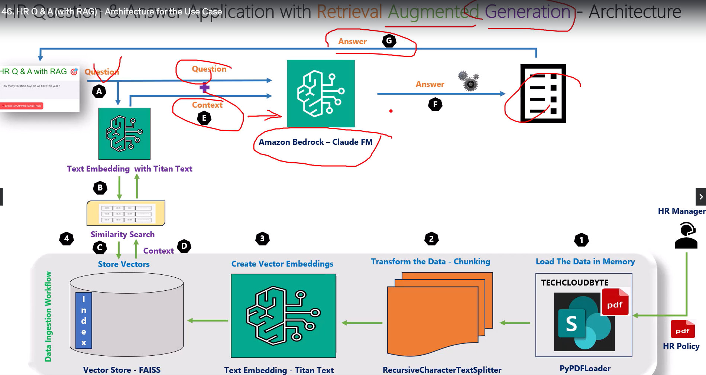

# Employee HR Q and A Application with RAG

## Services

* Amazon Bedrock - Claude FM
* Langchain
* HR Policy Document (PDF)

## Basic introduction to Vectors, Embeddings and Vector Search

* Vectors
    * Are mathematical representations of words, sentences and documents
    * Are represented by List of numbers or sequences of numbers
    * [1, 4]
* Embedding models
    * Is a model that converts words, sentence and documents in vectors
* Data Chunking
    * Text splitting: 
        * Split by character
        * Split by Token
        * Split by code
* Vector store
    * A database of vectors:
        * FAISS
        * Pinecode
        * Chroma DB
* Vector search
    * The process to search information based on a question prompt
* Cosine Similarity
    * A way to search vectors based on hypotenuse and triangule properties.
    * If cosine value is 1 (COS 0 = 1) the vectors are in the same direction.
    * If cosine value is 0 (COS 90 = 0) the vectors are not related.
    * If cosine value is -1 (COS 180 = -1) the vectors are opposite.
* k-nearest neighbor
    * KNN is a supervised machine learning algorithm used classification and regression tasks.
    * ANN: Approximate Nearest Neighbor
* Search

## Architecture of the Use Case

* Retrieve
    * Retrieve contet from the data store
* Augmented
    * Question + Context
* Generation
    * Generate a response
* Data Ingestion Workflow:
    * Load the data in memory
        * PyPDFLoader
    * Transform the Data - Chunking:
        * RecursiveCharacterTextSplit
    * Create Vector Embeddings:
        * Text embedding - Titan Text
    * Store vectors:
        * Vector Store - FAISS
            * Index
* Frontend flow:
    * Text embedding with Titan Text
    * Similarity search
    * Get Store Vectors
    * Initial question + Context (get from the data store)
        * Amazon Bedrock - Claude FM
    * Generate answer

## RAG Process

