# VPC and Networking using AWS

# General Information

[Slides and Extra Information](https://digitalcloud.training/aws-networking-masterclass-course-downloads/)

# Previous configuration to start to work with the project

We have the "Services Quotas" as a service to measure the quantity of instances or something like that in our available services (and so on, but I'm gonna check it with our AWS manager)

# Billing preferences

- Alert preferences: 
    * Billing and cost Management > Billing preferences > Alert preferences
- Simple notification service: 
    * Amazon SNS > Topics > Create topic 
    * (Inside the last topic) Subscriptions > Insert information
- CloudWatch:
    * CloudWatch > Alarms > Create alarms

# EC2 ssh key-pair.

SSH key-pair is by Region. 

To generate Key pair
- EC2 > Network & Security > Key Pairs > Create key pair

Putty and putty gen steps
- Download putty and puttygen
- open puttygen and load our .pem credentials

Create EC2 instance
- EC2 > Instances > Launch instances

Connect EC2 using putty
- Open putty.exe
- Configure HostName (or IP address)
- Connection > SSH > Auth > Credentials (file the .ppk file) > Open
- login as: ec2-user

# Buy a public domain and configure DNS

- Using the respective DNS provider
- DNS -> Amazon Route 53 -> Instance, CloudFront, LoadBalancer
- Amazon Route 53 > Hosted zones > Create hosted zone > 

# Simple automation to track unattended AWS usage

- Describe EC2 instances, Describe Get EBS Volumes, Describe EIPs. <- Lambda -> Simple Email Service -> User Inbox
- EventBridge for triggers 
- AWS Cloud Formation 

# AWS VPC & Networking Fundamentals

## Overview (The Big Picture)

Communication: User -> Internet -> Region -> Internet Gateway -> VPC -> Main Route Table -> Local Router -> Availability Zones -> Public Subnet -> EC2 Instance

### The common case

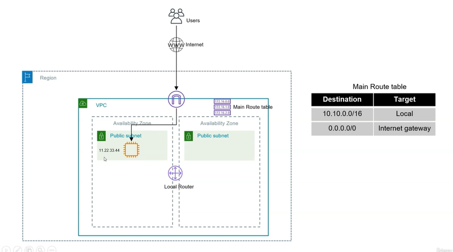

### Using EC2 Instances

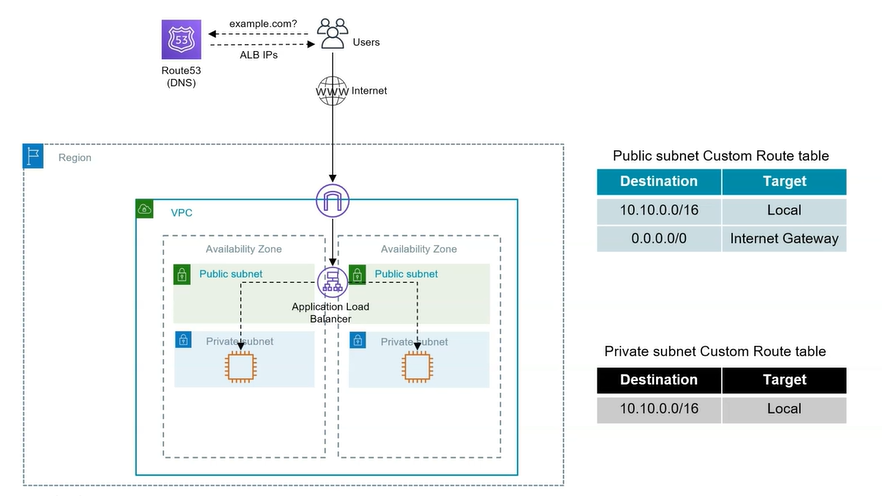

### Using a database

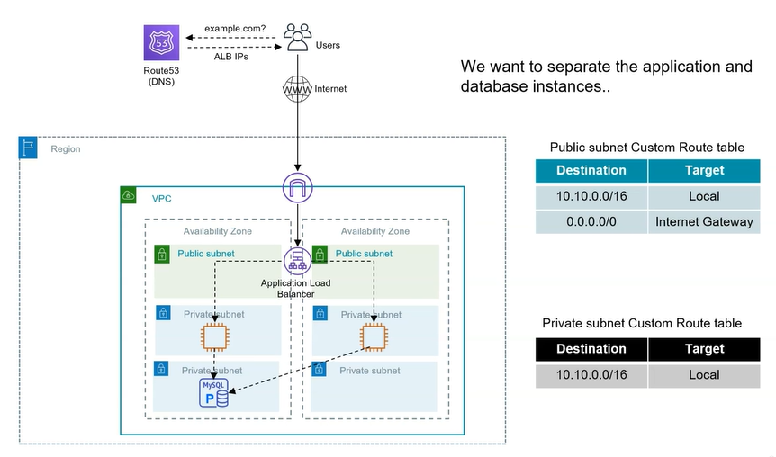

### Using a database replication

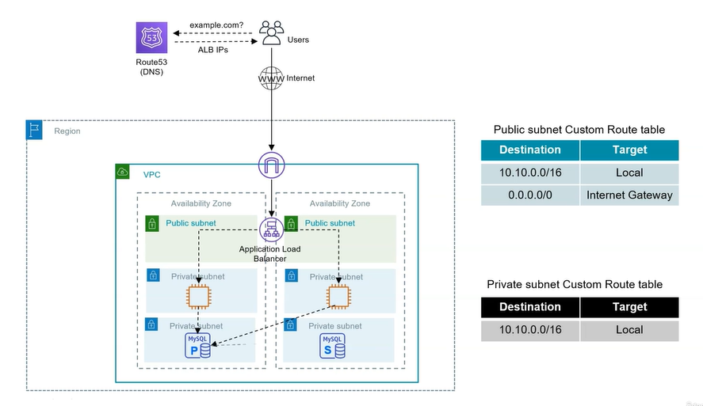

### Communicated out of the application

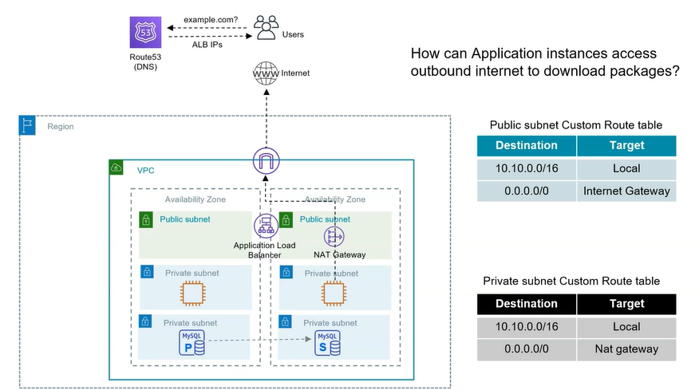

### Regional services (Don't use NAT Gateway in those cases)

#### VPC Endpoint (gateway)

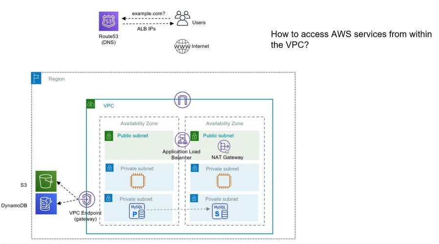

#### VPC Endpoint (interface) + Private Link

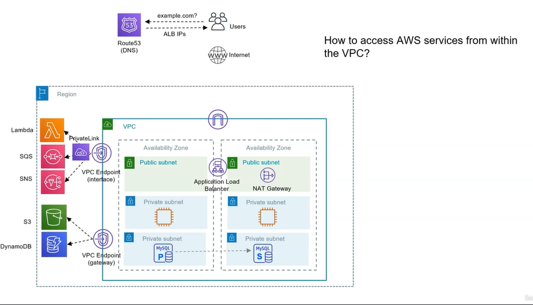

#### Service VPC

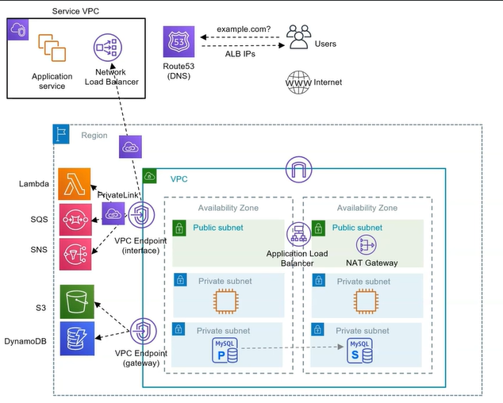

### Peering connection

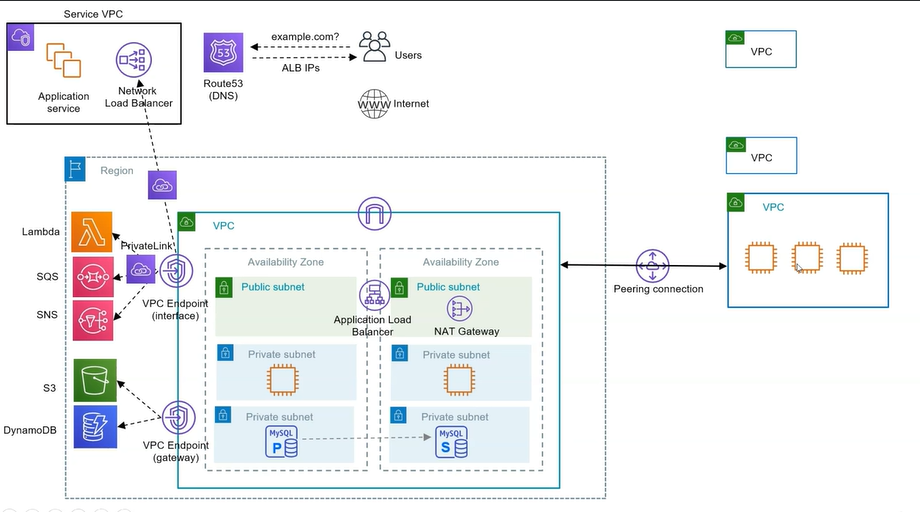

### Transit Gateway

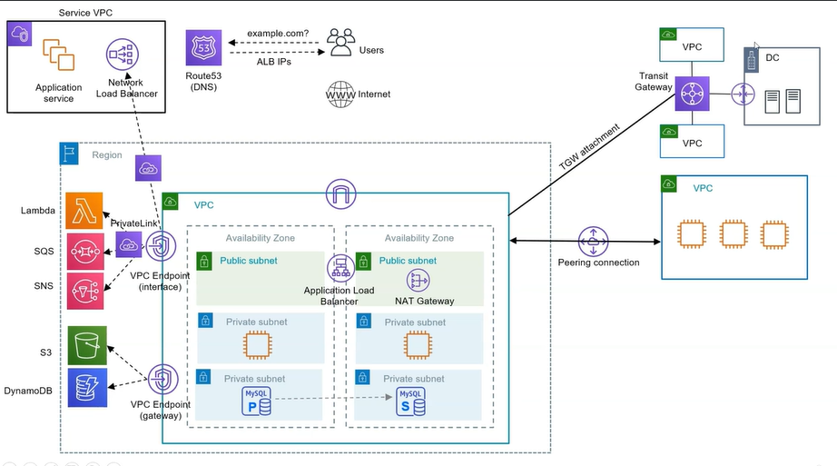

### On Premises

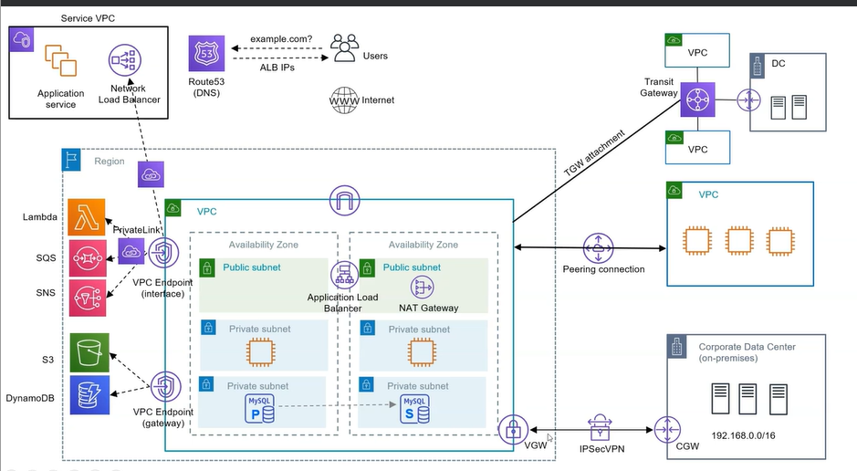

### Direct connect

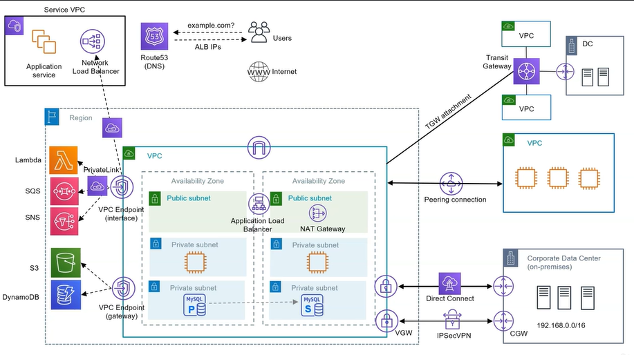

### Client VPN

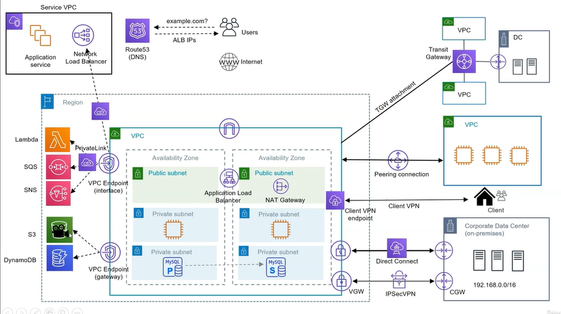

## VPC Introduction

Typical comunnication schema:

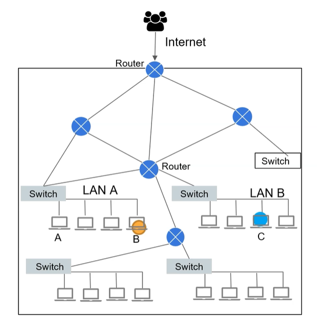

VPC is a Virtual Private Cloud, is similar to VLAN-X

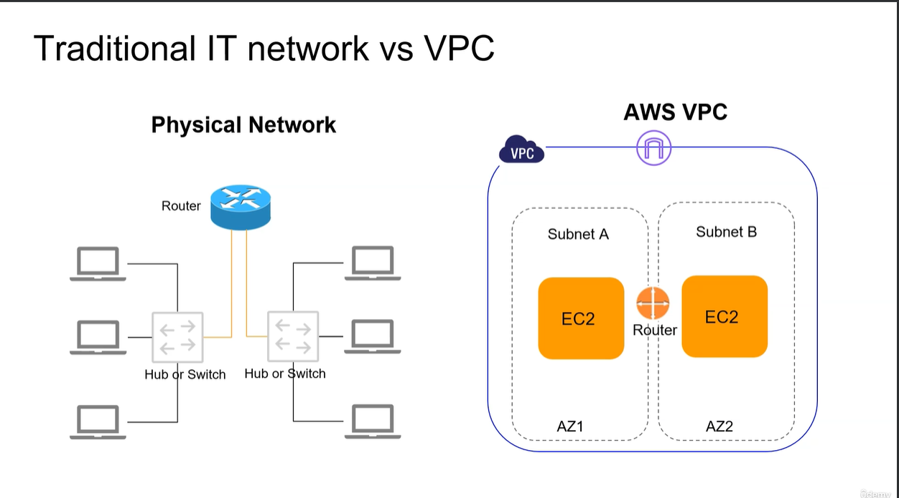

Scopes for each VPC:

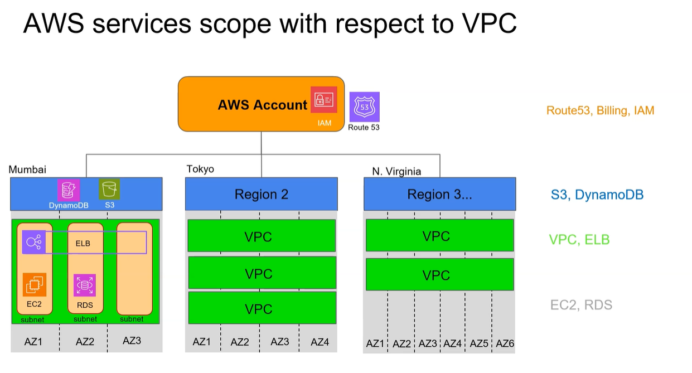

## VPC Building blocks

### VPC Routing

CIDR: Classless Inter Domain Router, range of ips for the networks. CIDR 10.0.0.0/16
Subnets: 
Route Tables: 

### VCP Security

Security groups: Any traffic will in or will out of your EC2
Network ACL: Access Control List, its scope is in subnet level

### Internet connection

Internet Gateway: Allows the communication with the outside world
VPN Gateway: Connect DataCenter with our AWS Region. In some cases we will use Direct Connect
DNS: Route53

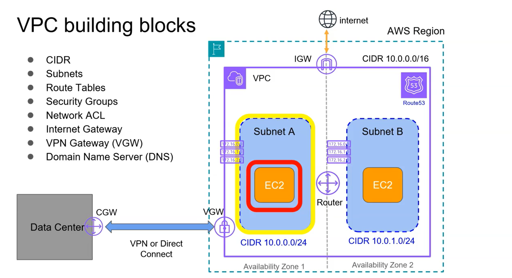

## First Hands-on

### CIDR

Maybe is the most confusing component to understand. We need to review the two types of IPs: IPv4 and IPv6 addresses.

# Glosary