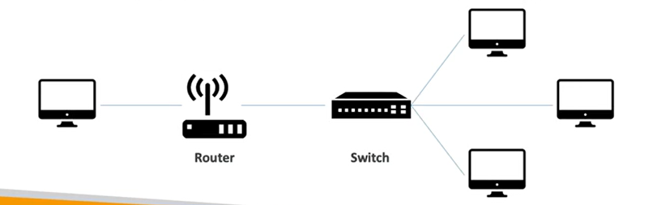
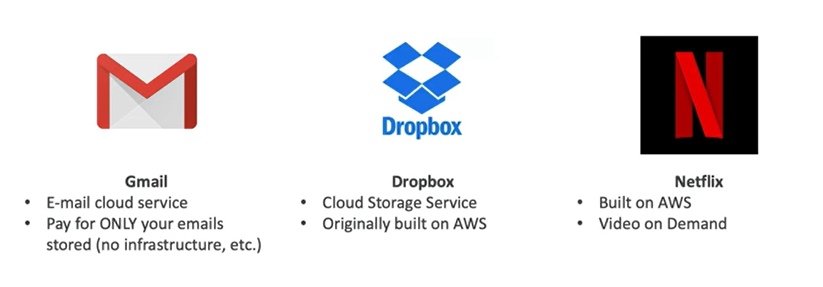
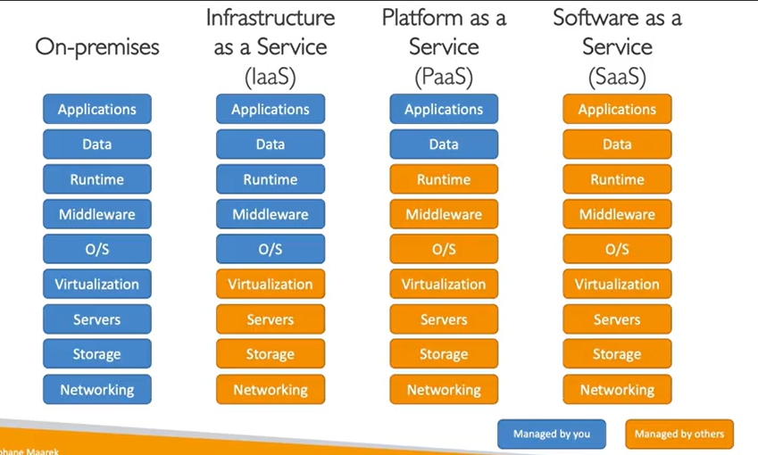
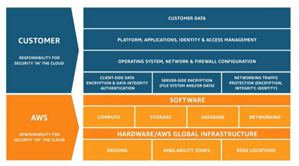

# Cloud practitioner

## Index
- [What is cloud computing?](#section1)
- [IAM - Identity and Access Management](#section2)
- []
- []
- []
- []
- [Databases and Analytics](#section7)
- []
- []
- []
- []
- []
- []
- []
- []
- []
- []
- []
- [AWS Architecting and Ecosystem](#section19)
- []

<div id="section1"> </div>

## What is cloud computing?

### Traditional IT Overview

The traditional way that the webservers works: 
- Client - Network - Server
- IP address
- Servers has
    - Compute: CPU
    - Memory: RAM
    - Storage: Data
    - Database: Store data in a structured way
    - Network: Routers, switch, DNS server. 



### Cloud computing

Key facts about cloud computing:
- On-demand delivery
- pay-as-you-go pricing
- provision exactly the right type and size of computing resources 
- you can access all the resources in seconds
- simple way to access servers, storage, databases and a set of application services
- Amazon Web Services owns and mantains the network-connected hardware




The deployment models of the cloud:
- Private Cloud (rackspace)
- Public Cloud (Azure, Google Cloud Platform, Amazon Web Service)
- Hybrid cloud (private cloud and public cloud)
- Multi Cloud

Five characeristics of Cloud Computing:
- On-deman self service
- Broad network access
- Multi-tenancy and resorce pooling
- Rapid elasticity and scalability
- Measured services

Six Advantages of Cloud Computing
- Trade capital expense for operational expense
- Benefit from massive economies of scale
- Stop guessing capacity
- Increase speed and agility
- Stop spending money running and maintaining data centers
- Go global in minutes

Problems solved by the cloud:
- Flexibility
- Cost-effectiveness
- Scalability
- Elasticity
- High-availability
- Agility

### Three types of cloud computing

Types of cloud computing:
- Infrastructure as a Service (IaaS) - EC2
- Platform as a Service (PaaS) - Elastic Beanstalk, Heroku
- Software as a Service (SaaS) - Rekognition, Zoom, Amazon Chime



Pricing of the cloud:
- Compute (Pay for compute time) (Lambda, EC2)
- Storage (Pay for data stored in the Cloud) (S3)
- Data transfer OUT of the cloud

### AWS Cloud overview

AWS Global infrastructure:
- AWS Regions
    - Compliance
    - Proximity
    - Available services
    - Pricing
- AWS Availability Zones
- AWS Data Centers
- AWS Edge Locations / Points of Presence

### Shared Responsability Model diagram

Customers are responsible "on" the cloud, AWS is responsible "of" the cloud.



<div id="section2"> </div>

## IAM - Identity and Access Management

- It is a global services.
- Root account: created by default, shouldn't be used or shared.
- Groups only contain users, not other groups. They
- Users don't have to belong to a group, and user can belong to multiple groups.
- User or Groups can be assigned JSON documents called policies
    - These policies define the permissions of the users
    - In AWS you apply the least privilege principle: don't give more permissions than a user needs

<div id="section3"> </div>

## EC2 - Elastic Cloud Computer

<div id="section4"> </div>

## EC2 Instance Storage

### Elastic Block Store (EBS)

* EBS (Elastic Block Store)
    * Attach to EC2
    * One instance at a time
    * One specific AZ
    * Multiple EBS volume for instance
    * Network usb stick
    * It is a network drive and for that reason we can have a bit latency
    * To migrate EBS volumen first you need to take a snapshot
    * You can set the GB and IOPS

* EBS Snapshots:
    * Make a backup of your EBS volumen
    * Do not need to detach the instance
    * Can copy snapshots across AZ or Region
    * EBS Snapshot Archive:
        * Takes within 24 to 72 hours for restoring
    * Recycle Bin for EBS Snapshots:
        * Retention from 1 day to 1 year

### Amazon Machine Image (AMI)

* AMI are a customization of an EC2 instance that
* AMI are built for a specific region (and can be copied across regions)
* You can launch EC2 instances from:
    * A Public AMI
    * Your own AMI
    * An AWS Marketplace AMI
* Process:
    * Start an EC2 instance
    * Stop the instance (for data integrity)
    * Build an AMI - this will also create EBS snapshot
    * Laun instances from another AMI

### EC2 Image Builder

* Used to automate the creation of VM or Container Images
    * Used for validate and test EC2 AMIs
    * Can be run on a schedule
    * Free service (only pay for the underlying resources)

### EC2 Instance Store

* EBS volumes are network drives with good but limited performance
* If you need a high-performance hardware disk, use EC2 Instance Store
* Better I/O performance
* EC2 Instance Store lose their storage if the are stopped (ephemeral)
* Risk of data loss if hardware fails

### Elastic File System (EFS)

* Managed NFS (network file system) that can be mounted on 100s of EC2
* Works with Linux EC2 instances in multi-AZ
* They use a EFS Mount Target
* EFS Infrequent Access (EFS-IA)
    * Storage class that is cost-optimized
    * You can use a Lifecycle Policy

### Amazon FSx Overview

* for Lustre, WIndows File Server, NetApp ONTAP

<div id="section5"> </div>

## ELB & ASG - Elastic Load Balancer and Auto Scaling Groups

### Scalability and High Availability

* Vertical Scalability
* Horizontal Scalability (elasticity)
    * Auto Scaling Group
    * Elastic Load Balancer
* High availability means running your app/system in at least 2 Availability Zones

### Elastic Load Balancing (ELB)

* Managed by AWS
* It forward internet traffic to multiple servers
* Expose a single point of access (DNS) to your application
* Do regular health checks to your instances
* Provide SSL termination (HTTPS) for your website
* High Availability across zones
* Kinds:
    * Application Load Balancer (HTTP/HTTPS) layer 7
    * Network Load Balancer (TCP/UDP) layer 4
        * Static IP through Elastic IP
    * Gateway Load Balancer - Layer 3
        * GENEVE Protocol on IP Packets
        * Route traffic to Firewalls
    * Classic Load Balncer - Layer 4 and 7

* Lab
    * Create two EC2 Instances
    * Create a new security group for an ELB
    * Create a new target group for an EC2 instances
    * Create the ELB

```bash
#!/bin/bash
# Use this for your user data (script from top to bottom)
# install httpd (Linux 2 version)
yum update -y
yum install -y httpd
systemctl start httpd
systemctl enable httpd
echo "<h1>Hello from @janobourian in $(hostname -f)</h1>" > /var/www/html/index.html
```

### Auto Scaling Group (ASG)

* In real-life, the load on your websites and application can change
* Set the minimum and the maximum number of machines running
* ASG:
    * Minimum Size
    * Actual Size
    * Maximum Size
* Process:
    * Load Balancer -> Auto Scaling Group -> EC2 instances
* Lab:
    * Create Base instance
    * Create Template
    * Create ASG based on our template
    * Configure ELB pointed our ASG
* Autoscaling strategies:
    * Manual Scaling
    * Dynamic Scaling
        * Simple / Step Scaling
    * Target Tracking Scaling
    * Schedule Scaling
    * Predictive Scaling

<div id="section6"> </div>

## Amazon S3 - Amazon Simple Storage Service 

### Amazon Simple Storage Service

* Amazon has "infinity" storage
* Use cases:
    * Backup and storage
    * Disaster recovery
    * Archive
    * Hybrid Cloud Storage
    * Hosting Application
    * Data lakes
    * Big data analytics
* Buckets
    * Regional level
* Objects
    * Key is the FULL path
        * prefix + object name
    * No concept of directories
    * Max object size 5TB
    * Object with more than 5GB must use "multi-part-upload"
    * Versioning

### Amazon S3 - Security

* Security:
    * User-Based:
        * IAM Policies
    * Resource-Based:
        * Bucket Policy
            * Allows Cross Account Access
        * Object Access Control List (OACL)
        * Bucket Access Control List (BACL)
    * Encription:
        * SSE: Service Side Encryption
        * KMS: Key Management Access
        * SSC: Client Side Encryption
        * Client Encryption

### Amazon S3 - Versioning

* You can version your files in Amazon S3
* Enable at bucket level

### Amazon S3 - Replication

* CRR
    * Cross Region Replication
* SRR
    * Same Region Replication
* Buckets can be in different AWS Accounts
* Copying is asynchronous
* Hands-On:
    * Create first bucket
    * Create target bucket

### Amazon S3 - Storage Classes

* S3 Storage Classes:
    * Standard
    * Standard Infrequent Access
    * Infrequent Access One Zone
    * Intelligent Tiering
        * Frequent Access 
        * Infrequent Access (30 days)
        * Archive Instant Access (90 days)
        * Archive Access  (90 days)
        * Deep Archive Access (180 days)
    * Glacier Instant Retrieval (90 days)
    * Glacier Flexible Retrieval:
        * Expedited (1 to 5 minutes)
        * Standard (3 to 5 hours)
        * Bulk (5 to 12 hours)
    * Glacier Deep Archive (180 days)
        * Standard (12 hours)
        * Bulk (48 hours)


* Life Cycle rules

### Amazon S3 and IAM

* IAM Access Analyzer for S3

### AWS Snow Family

* SnowCone:
    * Up to terabytes
    * 8TB - 14TB
* Snowball Edge
    * Up to Petabytes
    * 80TB - 210TB
* Snow Mobile
    * Up to Hexabytes

* Process:
    * Request Snowball device
    * Install the snowball client / AWS OpsHub

### Storage Gateway Overview

* AWS is pushing for "hybrid cloud"

<div id="section7"> </div>

## Databases & Analytics

* Database
    * Relational Databases
    * No Relational Databases

* Amazon Relational Database Service (Amazon RDS)
    * Postgres, MySQL, MariaDB, Oracle, Microsoft SQL Server, IBM DB2, Aurora
    * Is better to use RDS instead of a DB in EC2
    * You Can not SSH into your instances
    * Classic solution Architecture:
        * Elastic Load Balancer > Auto Scaling Groups > EC2 Instances > Database with RDS 
    * Aurora:
        * Is not open source
        * Support Postgres and MySQL
        * Aurora storage automatically grows in increments od 10GB, up to 128TB
        * Aurora costs more than RDS (20%)
        * Not in the free tier
    * Amazon Aurora Serverless
        * Pey per second
        * Use cases:
            * good for infrequent
            * intermittent or unpredictable workloads
        * It uses a Proxy Fleet

* RDS Deployments
    * Read Replicas
        * Can Create up to 15 Read Replicas
    * Multi-AZ
        * Failover in case of AZ outage
    * Multi-Region
        * Read Replicas
        * Disaster recovery
        * Local performance
        * Replication cost

* ElastiCache
    * Is for Redis or Memcached
    * Caches are in-memory databases with high performance, low latency
    * It reduces the pressure of the main database

* DynamoDB:
    * Serverlees and it has a millions of requests per second
    * Integrated with IAM for security, authorization and administration
    * Low cost and auto scaling capabilities
    * Standard and Infrequent Access (IA) Table Class
    * Type of data:
        * key/value
            * Partiton Key + Sort Key = Primary Key

* DynamoDB Accelerator - DAX
    * Give you best performance

* DynamoDB Global Tables:
    * Accesible with low latency in multiple-regions
    * Active-Active replication (read/write to any AWS Region)

* Amazon Redshift
    * Redshift is based on PostgreSQL, but it is not used for OLTP (Online transactions process)
    * It is for OLAP (Online Analytical Processing, analytics and data warehousing)
    * Columnar Storage of data
    * Massively Parallel Query Execution (MPP)
    * Redshift Serverless

* EMR
    * Elastic Map Reduce 
    * Hadoop clusters
    * Configure all EC2 instancies 
    * Auto-scaling and integrated with Spot instances
    * Use Cases:
        * data processing, machine learning, web indexing, big data

* Athena
    * Serverless query service to perfomr analytics against S3 objects
    * Uses standard SQL language to query the files
    * Supports CSV, JSON, ORC, Avro, and Parquet
    * $5 USD per TB
    * Use cases:
        * BI, Analytics, reporting, analyze, and VPC flow logs, ELB logs, CloudTrail trails
    * Exam Tip: Analyze data in S3 using serverless SQL use Athena

* Quicksight
    * Serveless machine learning-powered business intelligence service to create interactive dashboards

* DocumentDB
    * Is the same for MongoDB
    * MongoDB is used to store, query and index JSON data
    * Similar "deployment concepts" as Aurora

* Neptune
    * Fully managed graph database
    * A popular graph dataset woul be a social network
    * HA across 3 AZ, with up to 15 read replicas

* Timestream
    * Fully managed fast, scalable, serverlees time series database

* QLDB:
    * Quantum Ledger Database
    * A ledger is a book recording financial transactions
    * You can use SQL

* Managed Blockchain
    * Blockchain makes it possible to build applicaions where multiple parties can execute transactions without the need for a trusted, central authority

* Glue
    * Serverless
    * Sources: S4 Bucket and Amazon RDS
    * Targets Redshift
    * Managed extract, transform, and load (ETL) service
    * Useful to prepare and tranform data for analytics
    * Glue Data Catalog:
        * Catalog of datasets

* Data Migration Service
    * Migrate information
    * Supports:
        * Homogeneous migration
        * Heterogeneous migrations
    * It can transform the data


<div id="section8"> </div>

## Other Compute Services: ECS, Lambda, Batch, Lightsail

### Containers

* Docker
    * Docker Daemon is similar to Hypervisor
    * Storage:
        * Docker Hub
        * Elastic Container Registry

* Elastic Container Service
    * You must provision and mantain the infrastructure
    * Has integration with the ALB
* Amazon Fargate
    * Launch Docker Container as Serverless
* Elastic Container Registry:
    * Private Docker Registry on AWS
    * They can run on ECS or Fargate

### Serverless

* Main Stack:
    * Amazon S3
    * DynamoDB
    * Fargate
    * AWS Lambda
    * EventBridge

### Lambda

* Key concepts:
    * On demand
    * 15 minutes is the maximum
    * Pay:
        * Per request 1,000,000
        * Per time 400,000 GBs
    * Event-Driven
    * AWS CloudWatch
    * Until 10Gb per function

### API Gateway

* Building a serverless API
* Support sockets

### AWS Batch

* Batch processing
    * Jobs start and end
    * Launch EC2 instances or Spot Instances
    * Batch jobs are defined as Docker images and run on ECS

### LightSail

* Virtual servers, storage, databases, and networking
* Low and predictable pricing
* Great for people with little cloud experience
* Use cases:
    * Simple Web applications
    * Websites
    * Dev/Test environment
* It has High Availability but no auto-scaling 
* Some limitations to integrate AWS Services

<div id="section9"> </div>

## Deployments & Managing Infrastructure at Scale

### CLoudFormation

* You could automation deletion of templates
* Productivity
* Do not re-invent the wheel
* Application Composer (A visual way to work with your resources)

### CDK

* AWS Cloud Development Kit
* CDK CLI -> CLoudFormation Template -> CloudFormation

### Beanstalk

* PaaS
* Web App 3-tier:
    * ELB -> EC2 -> DataBase
* Three Architecture Models:
    * Single Instance deployment
    * ELB + ASG preproduction
    * ASG only
* Health agent and Checks for app health

### CodeDeploy

* AWS CodeDeploy
    * Hybrid Services
        * CodeDeploy Agent
    * Works with EC2

* AWS CodeCommit
    * Repository Manager

* AWS CodeBuild
    * Compile source code
    * Create packages ready to deploys
    * Serverless

* AWS CodePipeline:
    * Code -> Build -> Test -> Provision -> Deploy
    * CI/CD Tool

* AWS CodeArtifact
    * Install dependencies
    * Artifact Manager
    * Works with common dependecies such npm or pip

### Systems Manager (SSM)

* Hybrid Service
* Helps you manage your EC2 and On-premises system at scale
* Keys:
    * Patch
    * Run a command
    * Configure
    * Works using SSM Agent

### SSM Session Manager

* Allows you to start a secure shell on your EC2 and on-premises servers
* No SSH access, bastion hosts, or SSH keys
* No port 22 needed
* AmazonSSMManagedInstanceCore

### SSM Parameter Store

* Secure storage for configuration and secrets
* Serverless
* Control access permissions using IAM

<div id="section10"> </div>

## Leveraging the AWS Global Infrastructure

* Key concepts:
    * Regions
    * Edge Locations
    * Latency
    * Disaster Recovery (DR)
    * Hard to attack

### Route53

* Managed DNS
* Hosted Zones
* Records:
    * A
    * AAAA
    * CNAME: Hostname to Hostname
    * Alias: AWS Resources
* Routing Policies:
    * Simple
    * Weighted
    * Latency
    * Failover
    * Geolocalization
    * IPs range

### CloudFront

* Content Delivery Network
* Improves read performance, content is cached at the edge
* DDoS protection, integration with Shield and AWS Web Application Firewall
* Origins:
    * S3 Bucket
        * CloudFront Origin Access Control
    * Custom Origin (HTTP)
        * Application Load Balancer
        * EC2
        * S3 Website
        * Any HTTP
* CloudFront vs S3 Cross Region Replication
    * CloudFront
        * Global Edge Network
    * S3 Cross Region Replication
        * Read only
* Labs:
    * Create CloudFront
    * Create Control Settings
    * Set default object
    * Create Bucket policy to add Cloud Front

### S3 Transfer Acceleration

* Transfer S3 Bucket content to another Region using Edge Location

### AWS Global Accelerator

* Improve global application availability and performance
* It uses Edge Location
* Using AWS Network

### AWS Outposts

* Hybrid CLoud Service
* AWS Outposts are "server racks" in your corporation data center.
* Extension of AWS Service
* Services:
    * Amazon EC2
    * Amazon EBS
    * Amazon S3
    * Amazon EKS
    * Amazon ECS
    * Amazon RDS
    * Amazon EMR

### AWS WaveLenght

* 5G networks
* Brings AWS Services to the edge of the 5G networks
* It can be connected with some AWS Region

### AWS Local Zones

* Places AWS Services closer to the end users to run latency-sensitive applications
* Process:
    * Activate the local zone
    * Create a subnet for that local zone
    * Deploy an EC2 instance to work with your VPC but in the local zone

### Global Application Architecture

* Points to evaluate:
    * High Availability
    * Global Latency
    * Configuration

* Single Region, Single AZ
* Single Region, Multiple AZ
* Multi Region, Active-Pasive
* Multi Region, Active-Active


<div id="section11"> </div>

## Cloud Integrations

* Communicate applications
    * Synchronous
        * Application to Application
    * Asyncrhonous / Event Based
        * Application to Queue to Application

### SQS

* Queue model
* Producers (send) / Queue / Consumers (poll)
* Serverless to deocuple application
* Scales from 1 message per second to 10,000s
* Default retantion 4 days to maximum of 14
* Types:
    * FIFO: First In First Out
    * Standard

### Kinesis

* Real-time data streaming model
* Collect, process, and Analyze real-time streaming
* Services:
    * Kinesis Data Streams
        * Low latency streaming to ingest data 
    * Kinesis Data Firehose
        * Load streams into S3, Redshift, ElasticSearch
    * Kinesis Data Analytics
        * Perform real-time analytics on streams using SQL
    * Kinesis Video Streams
        * Perform real-time video streams for analytics or ML
* Pattern: 
    * Kinesis Data Streams
    * Kinesis Data Analytics
    * Kinesis Data Firehose

### SNS

* pub/sub model using SNS topic
* One message to many receivers
* Limits:
    * 12,500,000 subscriptions per topic
    * 100,000 topics limit

### Amazon MQ

* Protocols such as MQTT, AMQP, STOMP on premises
* We can usw MQ:
    * Managed Message Broker
    * Services:
        * RabbitMQ
        * ActiveMQ

<div id="section12"> </div>

## Cloud Monitoring

### CloudWatch

* Metrics for every service in AWS
* CloudWatch Dashboard Metrics
* Services:
    * EC2 Instances:
        * RAM is not available
    * EBS Volumes
    * S3 Buckets
    * Billing
    * Service Limits
    * Custom Metrics
* Alarms:
    * Trigger notifications for any metrics
    * States:
        * OK
        * INSUFICIENT_DATA
        * ALARM
* Logs:
    * Collect logs froms:
        * Elastic Beanstalk
        * EC2
        * CloudWatch log agents

### EventBridge

* Schedule: Cron jobs (scheduled scripts)
* Events:
    * Default Event Bus
    * Partner Event Bus
    * Custom Event Bus
* Schema Registry
* You can archive events

### CloudTrail

* Provides governance, compliance and audit for your AWS account
* Put logs
    * CloudWatch Logs
    * S3
* Can be applied to All Regions or only One Region

### X-Ray

* Visual Analysis of our application
* Full picture of each service
* Advantages:
    * Microservice architecture
    * Pinpoint
    * Performan
    * SLA (Service Leavel Agreement)

### Code Guru

* Key concepts:
    * Machine Learning service
    * Detect bugs
    * Automated code reviews
    * Application performance recommendations
    * Cost recommendations
    * Cloud and On-premises

### AWS Health Dashboard

* Service History:
    * All regions
* Your Account:
    * Personal Health Dashboard
    * About events that may impact you

<div id="section13"> </div>

## VPC & Networking

<div id="section14"> </div>

## Security and Compliance

### Shared Responsibility Model

* AWS: Security OF the Cloud
* Custome: Security IN the Cloud

### DDoS Protection: Shield and WAF

* Distributed Denial-of-Service
* AWS Shield:
    * Layer 3 and layer 4
    * Standard
    * Advanced: Premium
* AWS WAF
    * Filer content based on Web Access Control List
    * Layer 7
    * Deploy on:
        * ALB
        * AGW
        * CloudFront
* CloudFront
* Route53
* AWS Auto-Scaling

### AWS Network Firewall

* Protect all VPC
* Layer 3 to Layer 7

### AWS Firewall Manager

* Manage security Based on AWS Organization

### Penetration Testing

* Attack your own infrastructure
* Eight Services:
    * EC2, ELB and NAT Gateways
    * RDS
    * CloudFront
    * Aurora
    * AGW
    * AWS Lambda
    * Lightsail
    * Elastic Beanstalk

### Encryption with KMS and CloudHSM

* Data at rest
* Data in transit
* CloudHSM => Hardware Security Module

### AWS Certificate Manager (ACM)

### Secrets Manager

### Artifact Overview

### GuardDuty

### Inspector

### Config

### Macie

### Security Hub

### Amazon Detective

### AWS Abuse

### IAM Access Analyzer

<div id="section15"> </div>

## Machine Learning

### Amazon Rekognition

* Find objects, people, text, scenes in images and videos using ML
* Facial Analysis
* Create a database of `familiar faces`

### Amazon Transcribe 

* Transcribe speech to text
* It protects your personal

### Amazon Polly

* You can create audios based on text

### Amazon Translate

* It helps you to translate large volumes of text efficiently

### Amazon Lex + Amazon Connect

* Amazon Lex: is the same technology that powers Alexa:
    * Automatic Speech Recognition
    * Natural language understanding
    * Helps build chatbots, callcenters bots
* Amazon connect: Receive calls:
    * Creates contact flows, cloud-based virtual contact center
    * No upfront payments

### Amazon Comprehend

* For Natural Language Processing - NLP
* Analyze customer interactions

### Amazonn SageMaker

* Fully managed to build ML models
* Label -> Build ML model -> Train and Tune

### Amazon Forecast

* ML models to create forecasting models
* Upload data -> Amazon S3 -> Amazon Forecast -> Forecasting Model -> Future sales

### Amazon Kendra

* Document search service
* Extract answers from within a document

### Amazon Personalize

* Real time recomendations
* Amazon S3 / Real time API ->  Amazon Personalize -> Customized personalized API

### Amazon Textract

* Extract text for any document
* You can use it in financial services

<div id="section16"> </div>

## Account Management, Billing & Support

<div id="section17"> </div>

## Advanced Identity

<div id="section18"> </div>

## Other Services

<div id="section19"> </div>

## AWS Architencting & Ecosystem

* Well Architected Framework:
    * Best Practices:
        * Scalability
        * Disposable Resources
        * Automation
        * Loose Coupling
        * Services, not Servers

* Six pillars:
    * Operational Excellence
    * Security 
    * Reliability
    * Performance Efficiency
    * Cost Optimization
    * Sustainability

* Operational Excellence:
    * Includes the ability to run and monitor systems to deliver business value and to continually improve supporting processes and procedures
    * Design principles:
        * Perform operations as code
        * Make frequent, small, reversible changes
        * Refine operations procedures frequently
        * Anticipate failure
        * Learn from all operational faliures
        * Use Managed Services
        * Implement observability

* Operational Excellence AWS Services:
    * Prepare 
        * AWS Cloudformation
        * AWS Config
    * Operate
        * AWS CloudFormation
        * AWS Config
        * AWS CloudTrail
        * AWS CloudWatch
        * AWS X-Ray
    * Evolve
        * AWS CloudFormation
        * AWS CodePipeline
        * AWS CodeCommit
        * AWS CodeBuild
        * AWS CodeDeploy

* Security:
    * Includes the ability to protect information, systems, and assets while delivering business value through risk assesment and mitigation strategies
    * Design Principles:
        * Implement a strong identity foundation
        * Enable traceability
        * Apply security at all layers
        * Automate security best practices
        * Protect data in transint and at rest
        * Keep people away from data
        * Prepare for security events
    
* Security AWS Services
    * Identity and Access Management
        * IAM
        * AWS-STS
        * MFA token
        * AWS Organizations
    * Detective Controls
        * AWS Config
        * AWS CloudTrail
        * Amazon CloudWatch
    * Infrastructure Protection
        * Amazon CLoudFront
        * Amazon VPC
        * AWS Shield
        * AWS WAF
        * Amazon Inspector
    * Data protection
        * KMS
        * S3
        * Elastic Load Balancing
        * Amazon EBS
        * Amazon RDS
    * Incident Response
        * IAM
        * Amazon CloudFormation
        * Amazon CloudWatch Events

* Reliability:
    * Ability of a system to recover from infrastructure or service disruptions, dynamically acquire computing resources to meet demand, and mitigate disruptions such as misconfigurations or transient network issues
    * Desing Principles:
        * Test recovery procedures
        * Automatically recover from failure
        * Scale horizontally to increase aggregate system availability
        * Stop guessing capacity
        * Mange change in automation

* Reliability AWS Services:
    * Foundations
        * IAM
        * Amazon VPC
        * Service Quotas
        * AWS Trusted Advisor
    * Change Management
        * AWS Auto Scaling
        * Amazon CloudWatch
        * AWS CloudTrail
        * AWS Config
    * Failure Managment
        * Backups
        * AWS CloudFormation
        * Amazon S3
        * Amazon S3 Glacier
        * Amazon Route 53

* Performance Efficiency:
    * Includes the ability to use computing resources efficiently to meet system requirmentes, and to mantain that efficiency
    * Desing Principles
        * Democratize advanced technologies
        * Go global in minutes
        * Use serverless architectures
        * Experiment more often
        * Mechanical sympathy

* Performance Efficiency AWS Services
    * Selection:
        * AWS Auto Scaling
        * AWS Lambda
        * Amazon Elastic Block Store
        * Amazon S3
        * Amazon RDS
    * Review:
        * AWS CloudFormation
    * Monitoring:
        * Amazon CloudWatch
        * AWS Lambda
    * Tradeoffs:
        * Amazon RDS
        * Amazon ElastiCache
        * AWS Snowball
        * Amazon CloudFront

* Cost Optimization:
    * Includes the ability to run systems to deliver business value at the lowest price point
    * Desing Principles:
        * Adopt a consumption mode
        * Measure overall efficiency
        * Stop spending money on data centers operations
        * Analyze and attribute expenditure
        * Use managed and application level services to reduce cost of ownership

* Cost optimization AWS Services:
    * Expenditure Awareness:
        * AWS Budgets
        * AWS Cost and Usage Reports
        * AWS Cost Explore
        * Reserved Instance Reporting
    * Cost-effective Resources:
        * Spot instances
        * Reserved Instance 
        * Amazon S3 Glacier
    * Matching supply and demand:
        * AWS Auto Scaling
        * AWS Lambda
    * Optimizing Over time:
        * AWS Trusted Advisor
        * AWS Cost and Usage Report
        * AWS News Blog

* Sustainability:
    * Focuses on minimizing the environmental impacts of running cloud workloads
    * Design Principle:
        * Understand your impact
        * Establish sustainability goals
        * Maximize Utilization
        * Anticipate and adopt new, more efficient hardware and software offerings
        * Use managed services
        * Reduce the downstream impact of your cloud workloads
    
* Sustainability AWS Services:
    * EC2 Auto Scaling, Serverless Offering
    * Cost explorer, AWS Graviton 2, EC2 T instances, Spot Instances
    * ESF-IA, Amazon S3 Glacier
    * S3 lifecycle COnfigurations
    * Read Local, Write Global

* AWS Well-Architected Tool
    * Free tool to review your architecture against the six pillar Well-Architected Framework

* AWS Customer Carbon Footprint Tool

* AWS Cloud Adoption Framework (AWS CAF):
    * Helps you build and the execute a comprehensive plan for your digital transformation
    * Created with the best practices
    * Organizational capabilities
    * Six perspective:
        * Business
        * People
        * Governance
        * Platform
        * Security
        * Operations
    * Transformation domains:
        * Technology
        * Process
        * Organization
        * Product
    * Transformation Phases:
        * Envision 
        * Align
        * Launch
        * Scale
    * Business:
        * Reduce business risk
        * Improve ESG
    * Outcomes:
        * Grow revenue
        * Increase operational efficiency

* Right Sizing
    * CloudWatch
    * Cost Explorer
    * Trusted Advisor

* AWS Ecosystem
    * AWS Blogs
    * AWS Forums
    * AWS Whitepapers and Guides
    * AWS Partner Solutions
    * AWS Solutions
    * AWS Support
        * Developer
        * Business
        * Enterprise
    * AWS Marketplace:
        * Digital catalog from independent software vendors
        * Custom AMI
        * CloudFormation templates
        * Software as a Service Provider
        * Containers
    * AWS Training
        * AWS Digital and Classroom training
        * AWS Private Training
        * Training and Certification for the US Goverment
        * Training and Certification for the Enterprise
        * AWS Academy
    * AWS Professional Services and Partner Network
        * APN = AWS Partner Network
        * APN Technology Partners
        * APN COnsulting Partners
        * APN Training Partners
        * APN Competency Program
        * APN Navigate Program

* AWS IQ and re:Post
    * Quickly find professional help you for your AWS Projects

* AWS Knowledge center:
    * Contains the most frequent and common questions and requests

* AWS Managed Services (AMS):
    * Provides infrastructre and application support on AWS

<div id="section20"> </div>

## Preparing for the Exam + Practice Exam