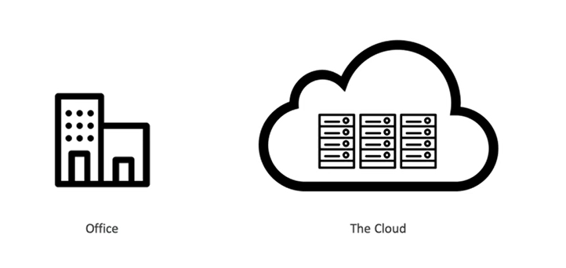

# Cloud practitioner

## Index
- [What is cloud computing?](#section1)
- [IAM - Identity and Access Management](#section2)
- []
- []
- []
- []
- [Databases and Analytics](#section7)
- []
- []
- []
- []
- []
- []
- []
- []
- []
- []
- []
- [AWS Architecting and Ecosystem](#section19)
- []

 

## What is cloud computing?

### Traditional IT Overview

The traditional way that the webservers works: 
- Client - Network - Server
- IP address
- Servers has
    - Compute: CPU
    - Memory: RAM
    - Storage: Data
    - Database: Store data in a structured way
    - Network: Routers, switch, DNS server. 

### Cloud computing

Key facts about cloud computing:
- On-demand delivery
- pay-as-you-go pricing
- provision exactly the right type and size of computing resources 
- you can access all the resources in seconds
- simple way to access servers, storage, databases and a set of application services
- Amazon Web Services owns and mantains the network-connected hardware

The deployment models of the cloud:
- Private Cloud (rackspace)
- Public Cloud (Azure, Google Cloud Platform, Amazon Web Service)
- Hybrid cloud (private cloud and public cloud)
- Multi Cloud

Five characeristics of Cloud Computing:
- On-deman self service
- Broad network access
- Multi-tenancy and resorce pooling
- Rapid elasticity and scalability
- Measured services

Six Advantages of Cloud Computing
- Trade capital expense for operational expense
- Benefit from massive economies of scale
- Stop guessing capacity
- Increase speed and agility
- Stop spending money running and maintaining data centers
- Go global in minutes

Problems solved by the cloud:
- Flexibility
- Cost-effectiveness
- Scalability
- Elasticity
- High-availability
- Agility

### Three types of cloud computing

Types of cloud computing:
- Infrastructure as a Service (IaaS) - EC2
- Platform as a Service (PaaS) - Elastic Beanstalk, Heroku
- Software as a Service (SaaS) - Rekognition, Zoom, Amazon Chime

Pricing of the cloud:
- Compute (Pay for compute time) (Lambda, EC2)
- Storage (Pay for data stored in the Cloud) (S3)
- Data transfer OUT of the cloud

### AWS Cloud overview

AWS Global infrastructure:
- AWS Regions
    - Compliance
    - Proximity
    - Available services
    - Pricing
- AWS Availability Zones
- AWS Data Centers
- AWS Edge Locations / Points of Presence

### Shared Responsability Model diagram

Customers are responsible "on" the cloud, AWS is responsible "of" the cloud.

 

## IAM - Identity and Access Management

- It is a global services.
- Root account: created by default, shouldn't be used or shared.
- Groups only contain users, not other groups. They
- Users don't have to belong to a group, and user can belong to multiple groups.
- User or Groups can be assigned JSON documents called policies
    - These policies define the permissions of the users
    - In AWS you apply the least privilege principle: don't give more permissions than a user needs

 

## EC2 - Elastic Cloud Computer

 

## EC2 Instance Storage

 

## ELB & ASG - Elastic Load Balancer and Auto Scaling Groups

 

## Amazon S3 - Amazon Simple Storage Service 

 

## Databases & Analytics

* Database
    * Relational Databases
    * No Relational Databases

* Amazon Relational Database Service (Amazon RDS)
    * Postgres, MySQL, MariaDB, Oracle, Microsoft SQL Server, IBM DB2, Aurora
    * Is better to use RDS instead of a DB in EC2
    * You Can not SSH into your instances
    * Classic solution Architecture:
        * Elastic Load Balancer > Auto Scaling Groups > EC2 Instances > Database with RDS 
    * Aurora:
        * Is not open source
        * Support Postgres and MySQL
        * Aurora storage automatically grows in increments od 10GB, up to 128TB
        * Aurora costs more than RDS (20%)
        * Not in the free tier
    * Amazon Aurora Serverless
        * Pey per second
        * Use cases:
            * good for infrequent
            * intermittent or unpredictable workloads
        * It uses a Proxy Fleet

* RDS Deployments
    * Read Replicas
        * Can Create up to 15 Read Replicas
    * Multi-AZ
        * Failover in case of AZ outage
    * Multi-Region
        * Read Replicas
        * Disaster recovery
        * Local performance
        * Replication cost

* ElastiCache
    * Is for Redis or Memcached
    * Caches are in-memory databases with high performance, low latency
    * It reduces the pressure of the main database

* DynamoDB:
    * Serverlees and it has a millions of requests per second
    * Integrated with IAM for security, authorization and administration
    * Low cost and auto scaling capabilities
    * Standard and Infrequent Access (IA) Table Class
    * Type of data:
        * key/value
            * Partiton Key + Sort Key = Primary Key

* DynamoDB Accelerator - DAX
    * Give you best performance

* DynamoDB Global Tables:
    * Accesible with low latency in multiple-regions
    * Active-Active replication (read/write to any AWS Region)

* Amazon Redshift
    * Redshift is based on PostgreSQL, but it is not used for OLTP (Online transactions process)
    * It is for OLAP (Online Analytical Processing, analytics and data warehousing)
    * Columnar Storage of data
    * Massively Parallel Query Execution (MPP)
    * Redshift Serverless

* EMR
    * Elastic Map Reduce 
    * Hadoop clusters
    * Configure all EC2 instancies 
    * Auto-scaling and integrated with Spot instances
    * Use Cases:
        * data processing, machine learning, web indexing, big data

* Athena
    * Serverless query service to perfomr analytics against S3 objects
    * Uses standard SQL language to query the files
    * Supports CSV, JSON, ORC, Avro, and Parquet
    * Use cases:
        * BI, Analytics, reporting, analyze, and VPC flow logs, ELB logs, CloudTrail trails
    * Exam Tip: Analyze data in S3 using serverless SQL use Athena

* Quicksight
    * Serveless machine learning-powered business intelligence service to create interactive dashboards

* DocumentDB
    * Is the same for MongoDB
    * MongoDB is used to store, query and index JSON data
    * Similar "deploymeny concepts" as Aurora

* Neptune
    * Fully managed graph database
    * A popular graph dataset woul be a social network
    * HA across 3 AZ, with up to 15 read replicas

* Timestream
    * Fully managed fast, scalable, serverlees time series database

* QLDB:
    * Quantum Ledger Database
    * A ledger is a book recording financial transactions
    * You can use SQL

* Managed Blockchain
    * Blockchain makes it possible to build applicaions where multiple parties can execute transactions without the need for a trusted, central authority

* Glue
    * Managed extract, transform, and load (ETL) service
    * Useful to prepare and tranform data for analytics
    * Glue Data Catalog

* Data Migration Service
    * Migrate information
    * Supports:
        * Homogeneous migration
        * Heterogeneous migrations
    * It can transform the data

 

## Other Compute Services: ECS, Lambda, Batch, Lightsail

 

## Deployments & Managing Infrastructure at Scale

 

## Leveraging the AWS Global Infrastructure

 

## Cloud Integrations

 

## Cloud Monitoring

 

## VPC & Networking

 

## Security and Compliance

 

## Machine Learning

### Amazon Rekognition

* Find objects, people, text, scenes in images and videos using ML
* Facial Analysis
* Create a database of `familiar faces`

### Amazon Transcribe 

* Transcribe speech to text
* It protects your personal

### Amazon Polly

* You can create audios based on text

### Amazon Translate

* It helps you to translate large volumes of text efficiently

### Amazon Lex + Amazon Connect

* Amazon Lex: is the same technology that powers Alexa:
    * Automatic Speech Recognition
    * Natural language understanding
    * Helps build chatbots, callcenters bots
* Amazon connect: Receive calls:
    * Creates contact flows, cloud-based virtual contact center
    * No upfront payments

### Amazon Comprehend

* For Natural Language Processing - NLP
* Analyze customer interactions

### Amazonn SageMaker

* Fully managed to build ML models
* Label -> Build ML model -> Train and Tune

### Amazon Forecast

* ML models to create forecasting models
* Upload data -> Amazon S3 -> Amazon Forecast -> Forecasting Model -> Future sales

### Amazon Kendra

* Document search service
* Extract answers from within a document

### Amazon Personalize

* Real time recomendations
* Amazon S3 / Real time API ->  Amazon Personalize -> Customized personalized API

### Amazon Textract

* Extract text for any document
* You can use it in financial services

 

## Account Management, Billing & Support

 

## Advanced Identity

 

## Other Services

 

## AWS Architencting & Ecosystem

* Well Architected Framework:
    * Best Practices:
        * Scalability
        * Disposable Resources
        * Automation
        * Loose Coupling
        * Services, not Servers

* Six pillars:
    * Operational Excellence
    * Security 
    * Reliability
    * Performance Efficiency
    * Cost Optimization
    * Sustainability

* Operational Excellence:
    * Includes the ability to run and monitor systems to deliver business value and to continually improve supporting processes and procedures
    * Design principles:
        * Perform operations as code
        * Make frequent, small, reversible changes
        * Refine operations procedures frequently
        * Anticipate failure
        * Learn from all operational faliures
        * Use Managed Services
        * Implement observability

* Operational Excellence AWS Services:
    * Prepare 
        * AWS Cloudformation
        * AWS Config
    * Operate
        * AWS CloudFormation
        * AWS Config
        * AWS CloudTrail
        * AWS CloudWatch
        * AWS X-Ray
    * Evolve
        * AWS CloudFormation
        * AWS CodePipeline
        * AWS CodeCommit
        * AWS CodeBuild
        * AWS CodeDeploy

 

## Preparing for the Exam + Practice Exam