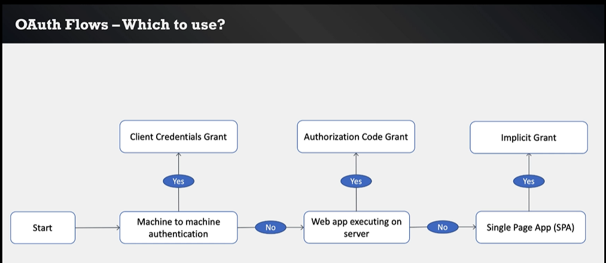
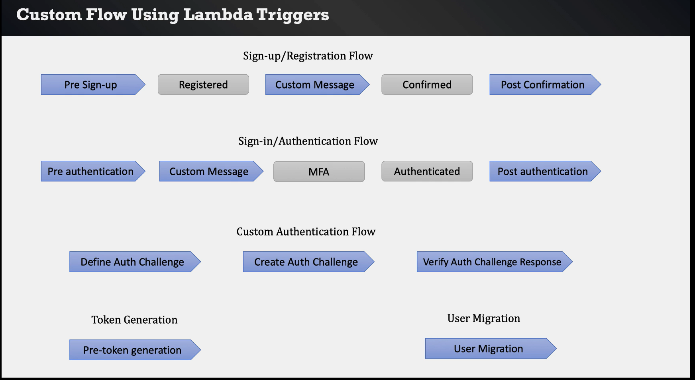
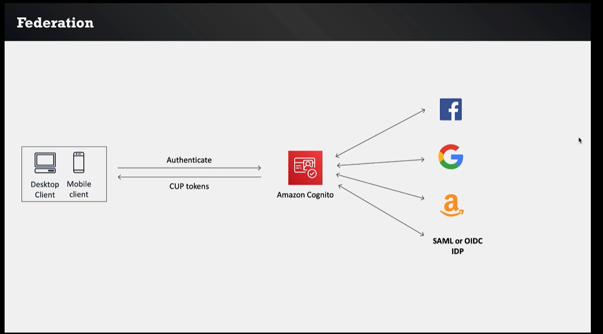
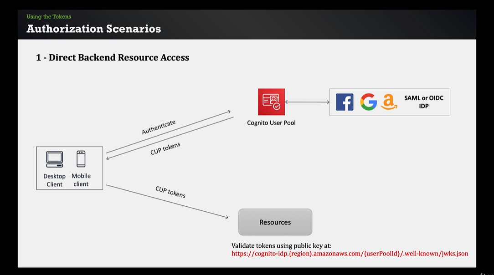
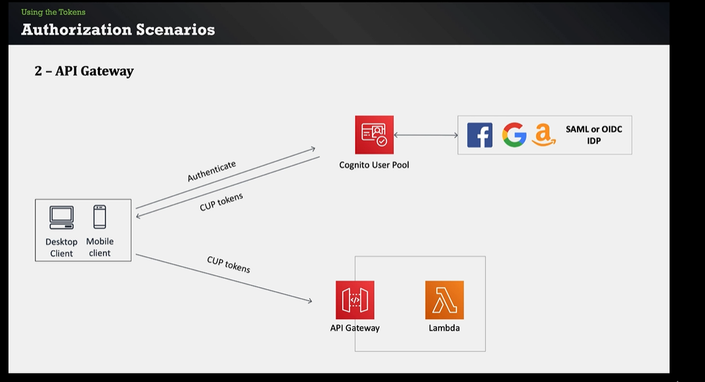
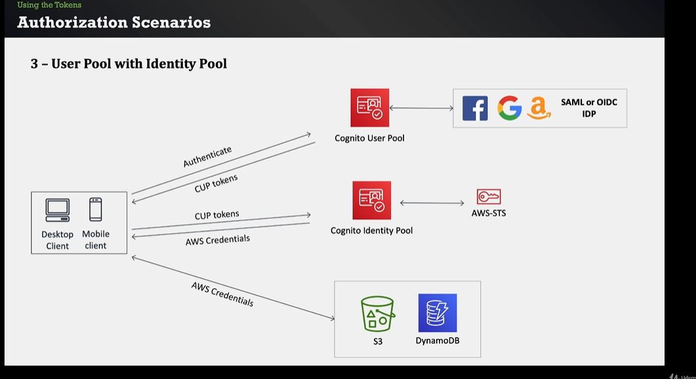

# Amazon Cognito

Topics: 
* Identity
* Authentication
* Authorization

Another AWS Services:
* API Gateway
* Lambda
* Dynamo DB

## Difference between Cognito user pool and Cognito identity pool

User pools are for authentication. Your app users can sign in through the user pool, or federate through a third-party identity provider (IdP). Identity pools are for authorization. You can use identity pools to create unique identities for users, and give them access to other AWS services.

Use a user pool in the following scenarios:
* Design sign-up and sign-in webpages for your app.
* Access and manage user data.
* Track your user device, location, and IP address, and adapt to sign-in requests of different risk levels.
* Use a custom authentication flow for your app.

Use an identity pool in the following scenarios:
* Give your users access to AWS resources, such as an Amazon Simple Storage Service (Amazon S3) bucket or an Amazon DynamoDB table.
* Generate temporary AWS credentials for unauthenticated users.


## Identity

You know who is and provides access levels.

Importance:
* Authentication
* Authorization
* Ownership
* User experience
* Protecting credentials in your database
* User flows:
    * Sign up
    * Sign in
    * Forgot/change password
    * Verify email/phone number
    * MFA
* Password policies
* Scaling

## Cognito

Cognito provides:
* Authentication
* Authorization
* User management
* User directory
* User flows
* SDK
* Custom lambda triggers
* Hosted UI
* Social identity support:
    * Facebook
    * Google
    * Amazon
    * SAML, etc
* Access AWS Resources (S3, Dynamo DB, etc) from your app
* Cognito is serverless service
* Security of serverless applications

## User pool and Identity pool


# Section 1

Topics:
* Identity
* Cognito service core features
* User pool and Identity pool

## User pool

You can use the Cognito Interface or Social Media Interface.

Features:
* Sign up
* Sign in
* Authentication flows:
    * Change and forgot password
    * MFA
    * Email and mobile verification
* Custom lambda triggers
* Hosted customizable UI and SDK
* Federation using Facebook, Google, Amazon or SAML and OIDC IDP.


## Create User Pool

Cognito Dashboard > User Pools > Create User Pool
Follow the steps

Users can be asigned to a group

## Hosted UI

```curl
curl --location 'https://janobourian.auth.us-east-1.amazoncognito.com/login?response_type=code&client_id=xxxxxxxxx&redirect_uri=https%3A%2F%2Fwww.google.com.mx%2F' \
--header 'Cookie: XSRF-TOKEN=b093437d-e1de-4e4b-b4e5-d29e66d9a5b8'
```

## Tokens

Tokens retrieved:
* ID Token: About identity username
* Access Token: Authorization information for resources
* Refresh Token: Information about the refresh token

JWT:
* Open standard
* JSON format
* 3 parts:
    * Header
    * Payload
    * Signature


## OAuth Flows

1.- Implicit grant
    response_type = token
    Returns ID and Access Token (No refresh token)
    SPA
2.- Authorization code grant
    response_type = code
    Return "Authorization code"
    Authorization code exchanged for ID, access and refresh token
    Server-side logic for exchanging authorization code for token
3.- Client credentials
    Machine to machine requests
    App client must have client secret in addition to app client id



## Lambda triggers



## Federation



## Using tokens







## Securing API Gateway Requests

The flow is the same as an Authorization with Lambda function

# Section 2

Topics:
* User pool details with lab

# Section 3

Topics:
* Identity pool with lab