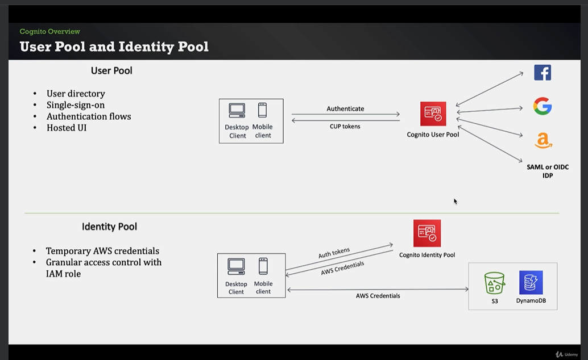
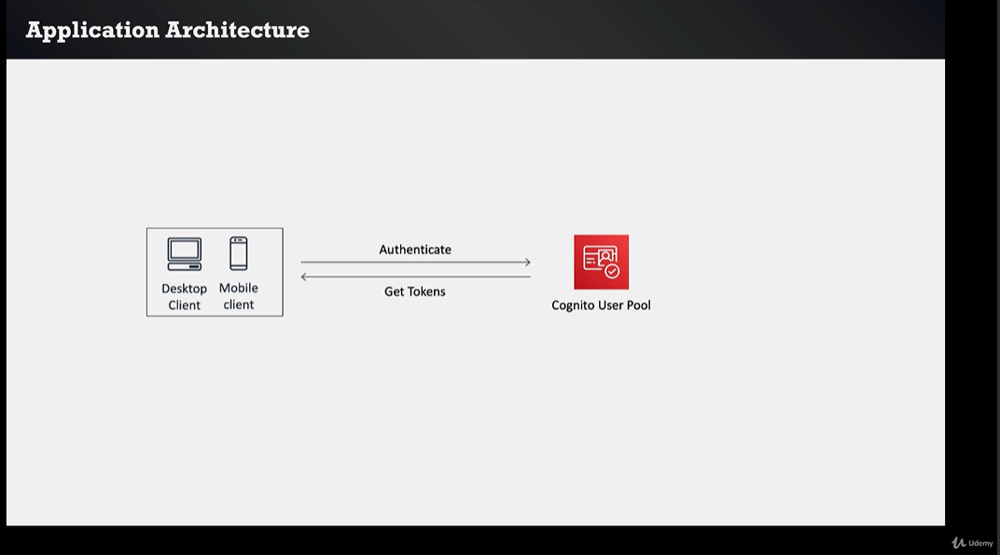

# Amazon Cognito

Topics: 
* Identity
* Authentication
* Authorization

Another AWS Services:
* API Gateway
* Lambda
* Dynamo DB

## Identity

You know who is and provides access levels.

Importance:
* Authentication
* Authorization
* Ownership
* User experience
* Protecting credentials in your database
* User flows:
    * Sign up
    * Sign in
    * Forgot/change password
    * Verify email/phone number
    * MFA
* Password policies
* Scaling

## Cognito

Cognito provides:
* Authentication
* Authorization
* User management
* User directory
* User flows
* SDK
* Custom lambda triggers
* Hosted UI
* Social identity support:
    * Facebook
    * Google
    * Amazon
    * SAML, etc
* Access AWS Resources (S3, Dynamo DB, etc) from your app
* Cognito is serverless service
* Security of serverless applications

## User pool and Identity pool



# Section 1

Topics:
* Identity
* Cognito service core features
* User pool and Identity pool

## User pool

You can use the Cognito Interface or Social Media Interface.

Features:
* Sign up
* Sign in
* Authentication flows:
    * Change and forgot password
    * MFA
    * Email and mobile verification
* Custom lambda triggers
* Hosted customizable UI and SDK
* Federation using Facebook, Google, Amazon or SAML and OIDC IDP.



## Create User Pool

Cognito Dashboard > User Pools > Create User Pool
Follow the steps

Users can be asigned to a group

## Hosted UI

```curl
curl --location 'https://janobourian.auth.us-east-1.amazoncognito.com/login?response_type=code&client_id=xxxxxxxxx&redirect_uri=https%3A%2F%2Fwww.google.com.mx%2F' \
--header 'Cookie: XSRF-TOKEN=b093437d-e1de-4e4b-b4e5-d29e66d9a5b8'
```

## Tokens

## OAuth Flows

## Lambda triggers


## Federation

## Using tokens

## Securing API Gateway Requests

# Section 2

Topics:
* User pool details with lab

# Section 3

Topics:
* Identity pool with lab