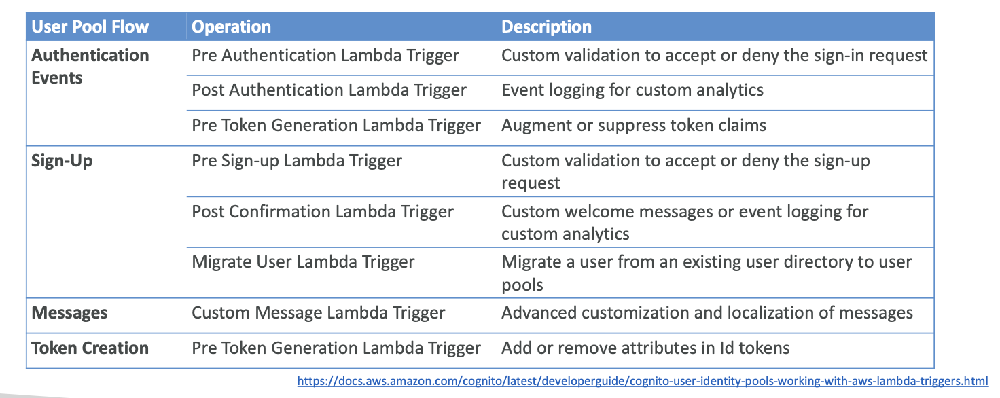

# Cognito

* Give users and identity to interact with our web or mobile application
* Cognito User Pools:
    * Sign in functionality for app users
    * Integrate with API Gateway and Application Load Balancer
* Cognito Identity Pools (Federated Identity):
    * Provide AWS Credentials to users so they can access AWS resources directly
    * Integrate with Cognito User Pools as an identity provider

## Cognito User Pools (CUP) - User Features

* Create a serverless database of user for your web and mobile apps
* Simple login: username / password
* Password Reset
* Email and Phone Number verification
* Multi-factor authentication (MFA)
* Federated Identities: users from Facebook, Google, SAML,...
* Feature: block users if their credentials are compromised elsewhere
* login sends back a JSON Web Token (JWT)

## Cognito User Pools - Lambda Triggers

* CUP can invoke a Lambda function syncrhonously on the triggers:

## Cognito User Pools - Hosted Authentication UI

* Cognito has a hosted authentication UI that you can add to your app to handle sign-up and sign-in workflows
* Using the hosted UI, you have a foundation for integration with social logins, OIDC or SAML
* Can customize with a custom logo and custom CSS

## CUP - Adaptive Authentication

* Block sign-ins or require MFA if the login appears suspicious
* Check for compromised credentials, account takeover protection, and phone and email verification

## Decoding a ID Token; JWT - JSON Web Token

* JWT is a compact, URL-safe means of representing claims to be transferred between two parties
* JWT consists of three parts: header, payload, and signature
* Header typically consists of the type of token (JWT) and the signing algorithm being used
* Payload contains the claims, which are statements about an entity (typically, the user) and additional data
* Signature is used to verify the integrity of the token and ensure that it has not been tampered with
* JWTs are commonly used for authentication and authorization in web applications and APIs

## Cognito Hands-On

* Applications
    * App clients
* User management
    * Users
    * Groups
* Authentication
    * Authentication methods
    * Sign-in
    * Sign-up
    * Social and external providers
    * Extensions
* Security
    * AWS WAF
    * Threat protection
    * Log streaming
* Branding
    * Domain
    * Managed login
    * Message template

## Application Load Balancer

* Your Application Load Balancer can securely authenticate users
* The ALB can make the redirection for authentication

## Cognito Identity Pools (Deferated Identities)

* Provide AWS Credentials to users so they can access AWS resources directly
* Integrate with Cognito User Pools as an identity provider
* Integrate with social identity providers (Facebook, Google, Amazon) and SAML-based providers
* You can apply condition in the IAM policies to restrict access

## Summary

* Cognito User Pools: user directory and authentication for web and mobile apps
* Cognito Identity Pools: provide AWS credentials to users so they can access AWS resources directly
* Cognito integrates with API Gateway and Application Load Balancer for authentication
* Cognito supports multi-factor authentication and adaptive authentication to enhance security
* Cognito provides a hosted authentication UI that can be customized
* Cognito User Pools can trigger Lambda functions for custom workflows during authentication events
* CUP + CIP = authentication + authorization