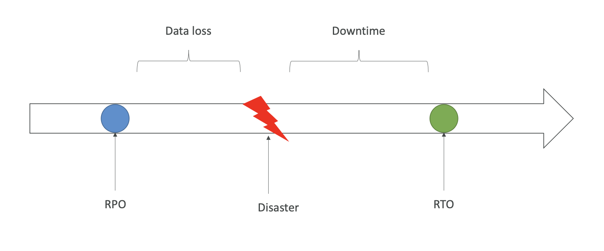
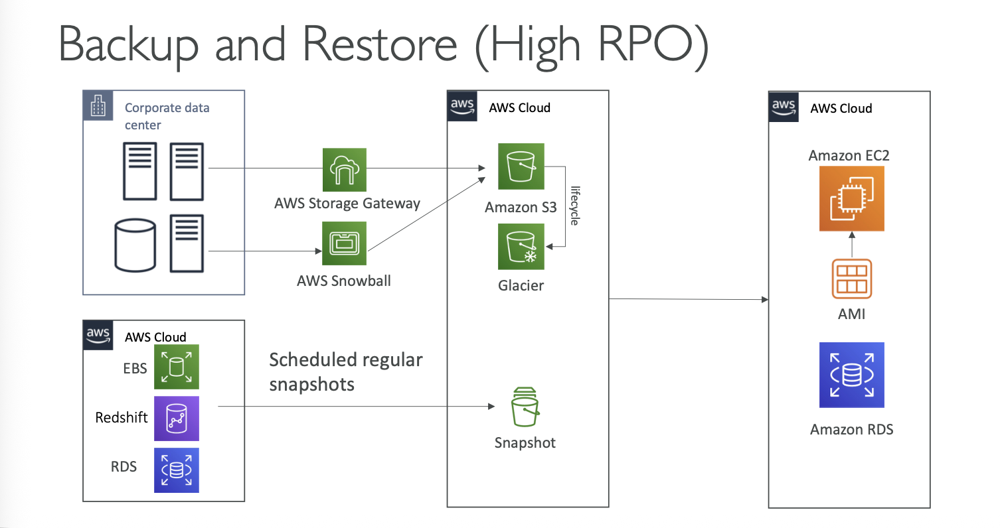
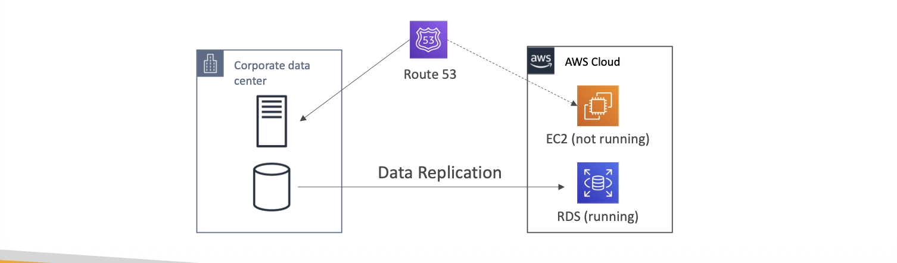
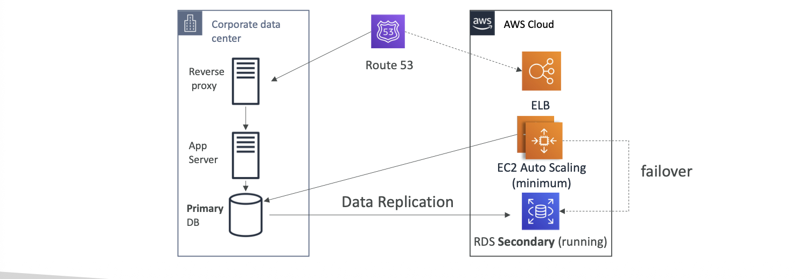
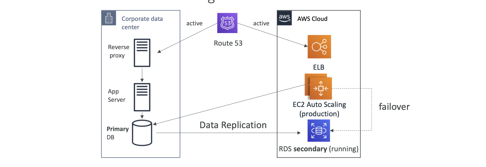
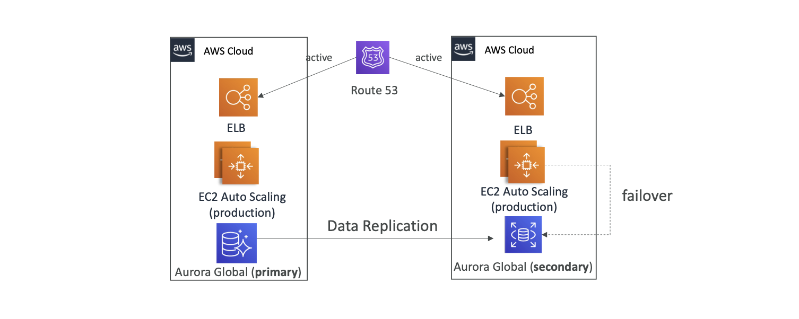

# Disaster Recovery and Migrations

## Disaster Recovery in AWS

* Disaster in AWS is any event that has negative impact on a company's business continuity or finances
* Disaster Recovery (DR) is the process, policies and procedures related to preparing for recovery or continuation of technology infrastructure critical to an organization after a natural or human-induced disaster
* Kind of disasters:
    * On-premises => On-premises
    * On-premises => AWS Cloud
    * AWS Cloud Region A => AWS Cloud Region B
* Important concepts: 
    * RPO: Recovery Point Objective
    * RTO: Recovery Time Objective

* DR strategies in AWS can be broadly classified into 4 categories:
    * Backup and Restore
    * Pilot Light
    * Warm Standby
    * Multi-Site Active-Active or Hot Site

### Backup and Restore

* Data is backed up and stored in AWS
* In the event of a disaster, data is restored from AWS to on-premises or to AWS Cloud
* Lowest cost option, but longest recovery time
* Suitable for non-critical applications with high RPO and RTO

### Pilot Light

* A minimal version of the environment is always running in AWS
* Critical core components are always running, while other components are scaled up when needed
* Faster recovery time than Backup and Restore
* Suitable for critical applications with moderate RPO and RTO

### Warm Standby

* A scaled-down version of a fully functional environment is always running in AWS
* The environment can be quickly scaled up to handle production traffic in the event of a disaster
* Faster recovery time than Pilot Light
* Suitable for business-critical applications with low RPO and RTO

### Multi-Site Active-Active or Hot Site

* A fully functional environment is always running in AWS
* Traffic is distributed between on-premises and AWS environments
* Immediate recovery time in the event of a disaster
* Suitable for mission-critical applications with very low RPO and RTO

### All AWS Multi Region

### Disaster recovery Tips

* Backup
    * EBS Snapshots, RDS automated backups or Snapshots, etc
    * Regular pushes to S3, S3 IA, Glacier, Lifecycle Policy, Cross region Replication
    * From On-Premises snowball or Storage Gateway
* High availability
    * Use Route 53 to migrate DNS over from Region to Region
    * RDS Multi-AZ, ElastiCache Multi-AZ, EFS, S3
    * Site to Site VPN as a recovery from Direct Connect
* Replication
    * RDS Replication (Cross Region), AWS Aurora + Global Databases
    * Database replication from on-premises to RDS
    * Storage Gateway
* Automation
    * CloudFormation / Elastic Beanstalk to re-create a whole new environment
    * Recover / Reboot EC2 instances with CloudWatch if alarms fail
    * AWS Lambda functions for cutomized automations
* Chaos
    * Netflix has a "simian-army" randomly terminating EC2

## Elastic Disaster Recovery

* Quickly and easily recover your physical, virtual, and cloud-based servers into AWS
* Continuous block-level replication for your servers
    * Corporate Data Center -> Staging -> Production

## Database Migration Service

* Quickly and securely migrate databases to AWS, resilient, self healing
* The source database remains available during the migration
* Supports:
    * Homogeneous migrations
    * Heterogeneous migrations
* Continuous Data Replication using CDC
* You must create an EC2 instance to perform the replication tasks

* Sources:
    * Databases
    * Azure
    * Amazon RDS
    * Amazon S3
    * DocumentDB

* Targets:
    * Databases
    * Amazon RDS
    * Redshift, DynamoDB, S3
    * OpenSearch Service
    * Kinesis Data Streams
    * Apache Kafka
    * DocumentDB, Amazon Neptune
    * Redis and Babelfish

* AWS Schema Conversion Tool (SCT)
    * Convert your DB Schema from one engine to another
    * Example: OLTP or OLAP
    * Prefer compute-intensive instances to optimize data conversions

* In On-Premises you should install Server with AWS SCT to schema conversion
* Data Migration
* With AWS DMS - Multi-AZ Deployment
    * Provides Data Redundancy
    * Eliminates I/O freezes
    * Minimizes latency spikes

## RDS and Aurora Migrations

## On-premises strategies with AWS

## AWS Backup

## Application Migration Service

## Transfering Large Datasets into AWS

## VMWare Cloud on AWS

