# Networking - VPC

This document provides an overview of Virtual Private Cloud (VPC) networking concepts and best practices for designing and implementing VPCs in AWS. 

## VPC Components 

* Internet Gateway: One by VPC, it allows to connect with the internet. 
* Transit Gateway: A way to avoid vpc peering hell, all conections in one place.
* VPC Peering Connections: Connect two vpc using a peering.
* VPN: Private connection between AWS and on-premises over the internet
* CGW: Customer Gateway to connect with AWS
* VGW: AWS side Gateway (Virtual Gateway) to connect the VPN over the internet
* VPN Hub: A VPN in AWS can be a hub to connect all on-premises networks
* DX: Direct connection between on-premises and AWS
* DX Location: Physical place where the connection is made
* Route Table: The rules that a Subnet o VPC componet follows to communicate with others. 
* NACL: Stateless, do it have permission to start a communication?
* VPC Endpoint: Connect your resources to AWS Services without internet, DNS should be allow
* Interface Endpont: $, ENI, Most of the services
* Gateway Endpoint: For S3, free
* VPC Flow Logs: Register the IP connections, it can be saved on S3, CloudWatch or Firehose
* NAT Gateway: It has regional option, allow to connect private subnet with other resources. 
* NAT Instances: Like NAT Gateway but this is a EC2 Instance
* Bastion Host: Check the private resources using an EC2 instance in a public subnet.
* Security groups: Stateful, to check the permissions between components.

## CIDR - IPv4

* Classless Inter-Domain Routing - a method for allocating IP addresses
* Used in Security Groups rules and AWS networking in general
* Base IP
    * Represents an IP contained in the range:
        * XX.XX.XX.XX
* Subnet Mask
    * Defines how many bits can change in the IP
    * Represented as /XX: /0, /24, /32
    * Example (take 256.256.256.256 and take the value):
        * /8 -> 255.0.0.0
        * /9 -> 255.32.0.0
        * /16 -> 255.255.0.0
        * /21 -> 255.255.248.0
        * /22 -> 255.255.252.0
        * /23 -> 255.255.254.0
        * /24 -> 255.255.255.0
        * /32 -> 255.255.255.255
* Public vs Private IP (IPv4)
    * Private IP:
        * 10.0.0.0 - 10.255.255.255 (10.0.0.0/8)
        * 172.16.0.0 - 172.31.255.255 (172.12.0.0/12)
        * 192.168.0.0 - 192.168.255.255 (192.168.0.0/16)
    * Public IP:
        * The rest of IPs
* Examples:
    * 192.168.0.0/30 => 2^2 = 4. 192.168.0.0 - 192.168.0.3 => 255.255.255.251
    * 192.168.0.0/28 => 2^4 = 16. 192.168.0.0 - 192.168.0.15 => 255.255.255.240
    * 192.168.0.0/20 => 2^12 = 4096. 192.168.0.0 - 192.168.16.0 => 255.255.240.0
    * 172.16.0.0/12 => 2^20 = 1,048,576. 172.16.0.0 - 172.31.255.255 => 255.240.0.0

## Public vs Private IP (IPv4)

* The Internet Assigned Numbers Authoriry (IANA) established certain blocks of IPv4 for the use of private (LAN) and public (Internet) addresses
* Private IP:
    * 10.0.0.0/8 --> 10.255.255.255
    * 172.16.0.0/12 --> 172.31.255.255
    * /12 -> 255.240.0.0 -> 172.16.0.0 - 172.31.255.255 (sum all and substract one)
    * 196.168.0.0/16 --> 196.168.255.255
* Public IP:
    The rest of the IPs
* All new AWS accounts have a a default VPC
* EC2 are launched into the default VPC with public access
* You can create your own VPCs with custom CIDR blocks
* 5 AWS VPC per region (soft-limit)
* Each VPC can have up to 200 subnets (soft-limit)
* Each subnet must reside entirely within one AZ
* Subnets can be public or private
* VPC min size: /28 -> 16 IPs
* VPC max size: /16 -> 65536 IPs
* AWS reserves 5 IPs per subnet:
    * 10.0.0.0 -> Network address
    * 10.0.0.1 -> VPC Router
    * 10.0.0.2 -> DNS Server
    * 10.0.0.3 -> Future use
    * 10.0.0.255 -> Broadcast address

* Exam tip: if you nee 29 IP addresses for EC2 instances:
    * You can not choose a subnet /27 (32 IP addresses, 32 - 5 = 27 < 29)
    * You can choose /26 (64 IP addresses, 64 -  5 = 59 > 29)

## Internet Gateway (IGW)

* Allows resources in a VPC connect to the internet
* It scales horizontally and is highly available and redundant
* Must be created separatly from a VPC
* One VPC can only be attached to one IGW and viceversa
* Internet Gateways on their own do not allow internet access
* Route tables must also be edited
    * You should check the subnets route tables
    * You should add the Internet Gateway to the Subnet Route Table
* Subnets can manage the auto assign IPv4 operations

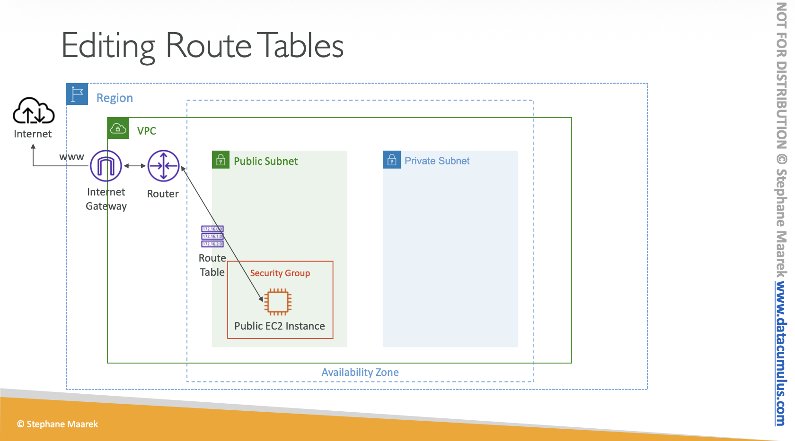

## Bastion Host

* We can use a Bastion Host to SSH into our private EC2 instance
* A Bastion Host is a special purpose instance that sits in a public subnet
* It is used to securely connect to instances in a private subnet
* The Bastion Host must have a security group that allows SSH access from the internet
* The private instance must have a security group that allows SSH access from the Bastion Host security

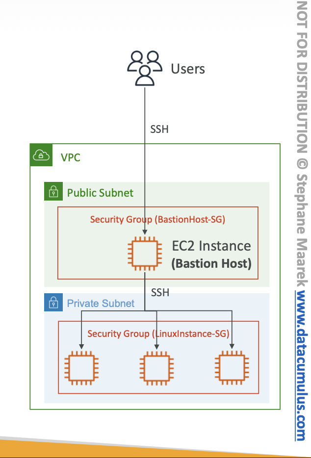

## NAT Instance

* Network Address Translation
* Used to allow instances in a private subnet to access the internet
* It is an EC2 instance configured to forward traffic to the internet
* It must be launched in a public subnet with a security group that allows inbound traffic from the internet
* Must disable EC2 setting: Source/destination Check
* Route Tables must be configured to route traffic from private subnets to the NAT Instance
* Exist a preconfigured AMIs
* Comments:
    * Pre-configured Amazon Linux AMI is available
    * Not Highly available/resilient setup out of the box
        * You need to create an ASG in multi-AZ + resilient user-data script
    * Internet traffic bandwith depends on EC2 instance type
    * You must manage Security Groups and rules

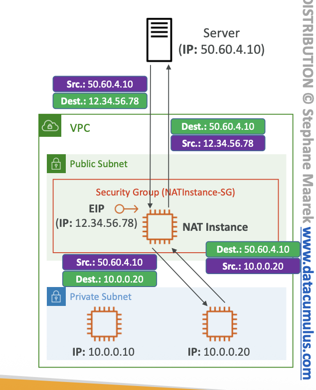

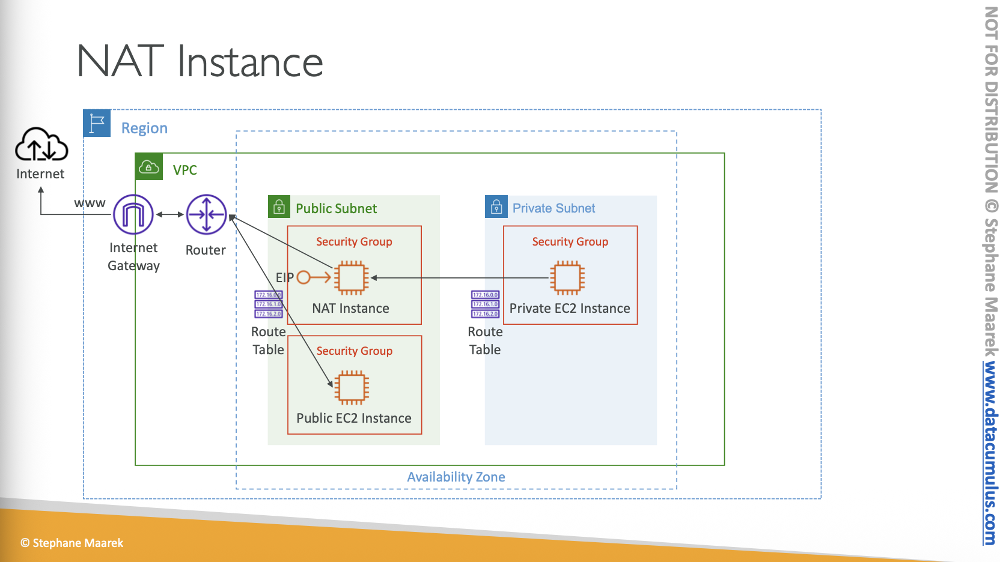

## NAT Gateway

* AWS-managed NAT, higher bandwidth, high availability, no administration
* Pay per hour for usage and bandwith
* Must be created in a public subnet
* Must be associated with an Elastic IP
* Route Tables must be configured to route traffic from private subnets to the NAT Gateway
* Requires an IGW (Private Subnet => NATGW => IGW)
* 5 Gbps on bandwith with automatic scaling up to 100 Gbps
* Highly available within an AZ
* No Security Groups to manage / required
* Recommended over NAT Instances for most use cases
* There is no cross-AZ failover needed because if an AZ goes down it does not need NAT

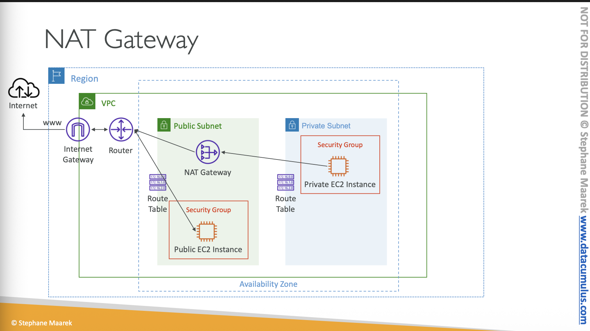

## Security Groups and NACLs

* Security Groups
    * Act as virtual firewalls for EC2 instances
    * Operate at the instance level
    * Stateful: return traffic is automatically allowed, no need to create rules
    * Allow rules only (no deny rules)
    * Can be associated with multiple instances
    * Can have multiple security groups associated with a single instance

* Network Access Control Lists (NACLs):
    * NACLs are stateless
    * Operate at the subnet level
    * Allow and deny rules
    * Can be associated with multiple subnets
    * Each subnet must be associated with a NACL, if none is specified the default NACL
    * Default NACL allows all inbound and outbound traffic

* Stateful in this context: Allowed traffic
* Stateless in this context: Always evaluate the traffic

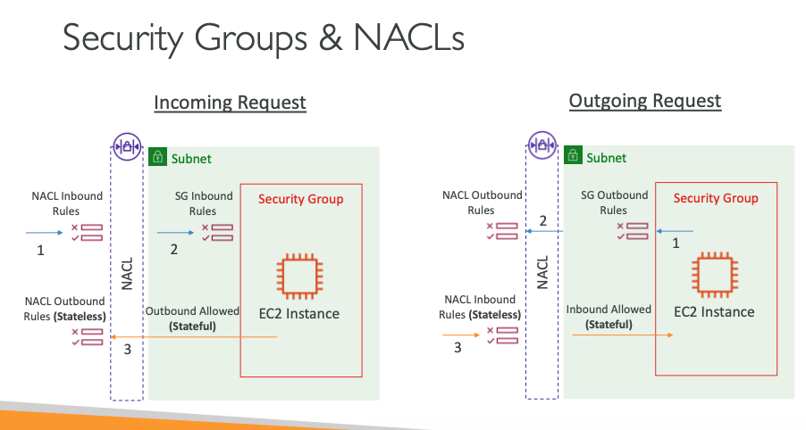

* NACLs
    * Are like a firewall which control traffic from and to subnets
    * One NACL per subnet, new subnets are ssigned the Default NACL
    * You define NACL Rules
        * 100 ALLOW
        * "*" <- to deny traffic that does not match
    * NACL are a great way of blocking a specific IP address at the subnet level
    * Do not modify the Default NACL, instead create custom NACL

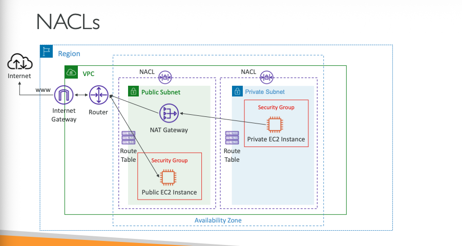

* Ephemeral Ports
    * For any two endpoints to establich a connection, they must use port
    * Cliente connect to a defined port, and expect a response on an ephemeral port
    * Ephemeral ports are temporary ports assigned for the duration of a communication session

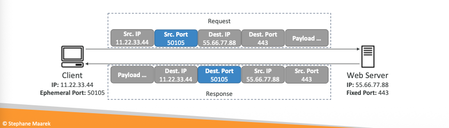

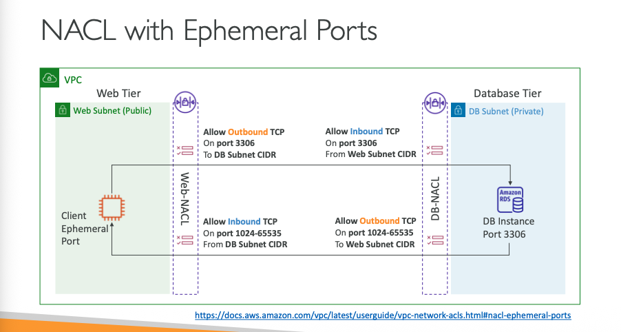

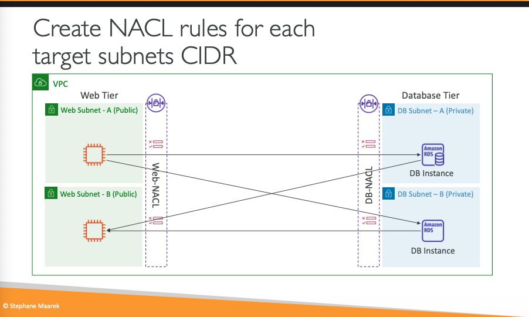

* Differences between Security Groups and NACLs:
    * SGs are stateful because they allow the outside communication
    * NACLs are stateless because they review the acess control list in every request
    * SGa at instance leves vs NACLs at subnet level
    * SGs only allow rules vs NACLs allow and deny rules
    * SGs are associated with multiple instances vs NACLs are associated with multiple subnets
    * Default SG allows all inbound and outbound traffic vs Default NACL allows all inbound and outbound traffic

## VPC Peering

* Networking connection between two VPCs
* Can be within the same AWS account or different AWS accounts
* VPCs can be in different regions (Inter-Region VPC Peering)
* VPC Peering connection is not trantitive
* No single point of failure or bandwidth bottleneck
* Traffic between peered VPCs stays on the global AWS backbone
* You must update route tables in each VPC to enable routing of traffic between them
* You can not have overlapping CIDR blocks between peered VPCs
* There are no bandwidth limitations
* There are no additional hops, low latency connection
* There is no need for a gateway, VPN connection, or separate physical hardware
* Peered VPCs can communicate using private IP addresses
* You can peer VPCs across different AWS accounts

### VPC Peering Hands On

* Create two VPCs with non-overlapping CIDR blocks
* Crete the vpc peering
* Update route tables in both VPCs to enable routing between them
* Test the connectivity between instances in both VPCs using private IP addresses

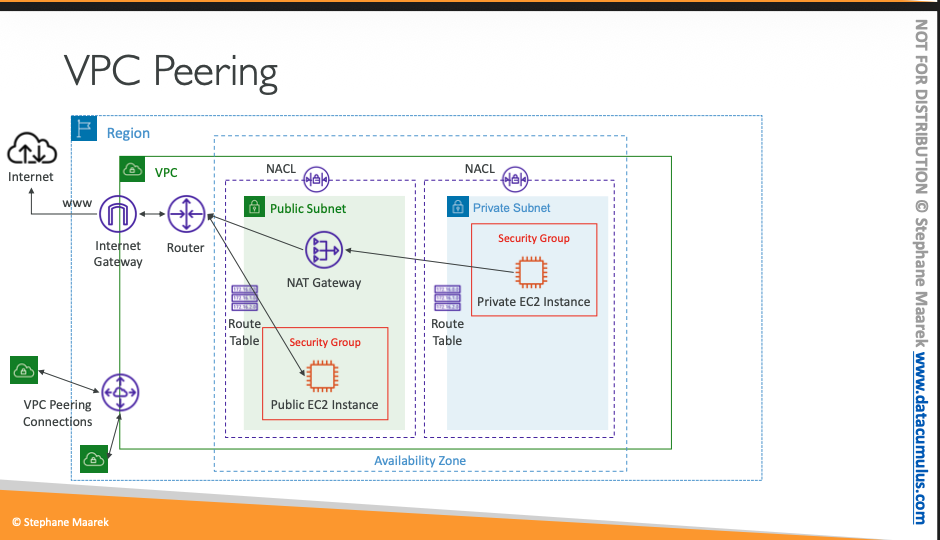

## VPC Endpoints

* To work with aws services.
* Every AWS service is publicly exposed
* VPC Endpoints allows you to connect to AWS services using a private network.
* Two types of VPC Endpoints:
    * Interface Endpoints: Use AWS PrivateLink to connect to services using ENIs
    * Gateway Endpoints: Use route tables to connect to services like S3 and DynamoDB
* DNS name should be enabled.
* Associated by subnet and security groups

### Interface Endpoints (powered by PrivateLink)

* Use AWS PrivateLink to connect to services using ENIs
* Create an elastic network interface (ENI) in your subnet
* Assign private IP addresses from your VPC to the ENI
* Use security groups to control access to the endpoint
* Supports connections to AWS services, third-party services, and your own services
* $ per hour + $ per GB of data processed

### Gateway Endpoints

* Use route tables to connect to services like S3 and DynamoDB
* Create a gateway endpoint for the service 
* Update route tables to direct traffic to the endpoint
* No additional cost for using gateway endpoints
* Supports both S3 and DynamoDB
* Free

Note: Interface Endpoint for S3 is preferred when you require access from your on premises (Site to Site VPN or Direct Connect), a different VPC or a different region.

## VPC Flow Logs

* Capture information about the IP traffic going to and from network interfaces in your VPC:
* Can be created at the VPC, subnet, or network interface level
* Logs can be published to Amazon CloudWatch Logs or Amazon S3
* Useful for monitoring and troubleshooting network connectivity issues
* Can help with security analysis and compliance auditing
* Can be filtered based on traffic type (accepted, rejected, or all)
* No additional cost for creating VPC Flow Logs, but there are costs for storing and analyzing
* Can be created and deleted without disrupting network traffic
* You can use S3, CloudWatch Logs, and Kinesis Data Firehose
* Captures network information from AWS managed interfaces too:
    * ELB
    * RDS
    * Redshift
    * ElastiCache
    * WorkSpaces
    * NATGW
    * TransitGateway

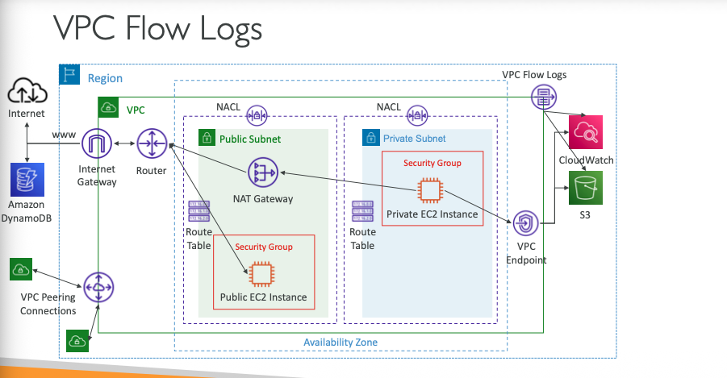

* Structure
    * Version
    * Account id
    * Interface id
    * Source Address
    * Destination Address
    * Source Port
    * Destinantio Port
    * Protocol
    * Packets
    * Bytes
    * Start
    * End
    * Action
    * Log Status

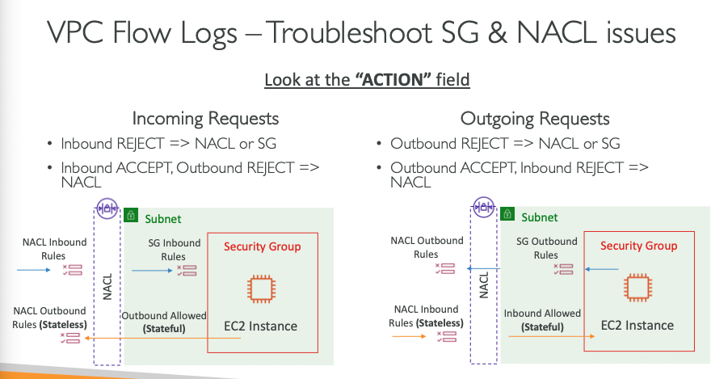

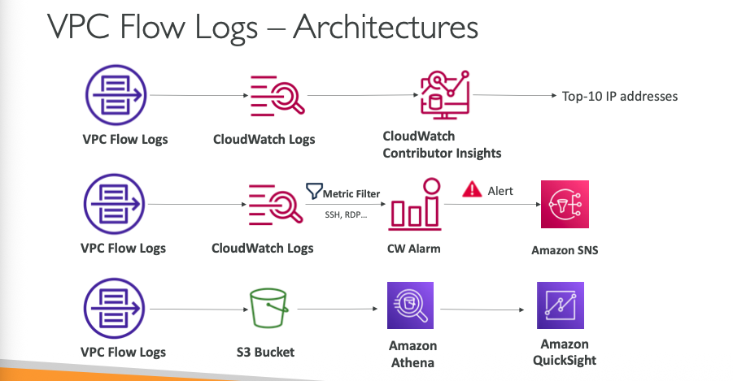

## AWS Site-to-Site VPN

* Secure connection between on-premises network and AWS VPC over the internet
* Uses IPsec protocol to encrypt data in transit
* Consists of two main components:
    * Customer Gateway (CGW): Represents the on-premises gateway device
    * Virtual Private Gateway (VGW): Represents the AWS side of the VPN connection
* Supports both static and dynamic routing (BGP)
* Supports multiple VPN tunnels for redundancy and high availability
* Can be used in conjunction with AWS Direct Connect for hybrid connectivity
* Pay-as-you-go pricing model based on connection hours and data transfer
* Supports both policy-based and route-based VPNs
* Can be configured using the AWS Management Console, CLI, or SDKs
* Supports a wide range of customer gateway devices from various vendors

### AWS VPN CloudHub

* Provide secure communication between multiple sites, if you have multiple VPN connections
* Low-cost hub and-spoke model for primary or secondary network connectivity between different locations (VPN only)
* To set it up, connect multiple VPN connections on the same VGW, setup dynamic routing and configure route tables.

## Direct Connect (DX)

* Dedicated network connection between on-premises data center and AWS
* Provides a more consistent network experience compared to internet-based connections
* Can be used to connect to all AWS services in a specific region
* Supports speeds ranging from 50 Mbps to 100 Gbps
* Can be used in conjunction with AWS Site-to-Site VPN for hybrid connectivity
* Requires a Direct Connect Gateway to connect to multiple VPCs across different regions
* Pay-as-you-go pricing model based on port hours and data transfer
* Supports link aggregation (LAG) for increased bandwidth and redundancy
* Requires working with an AWS Direct Connect Partner or colocation provider to establish the physical connection

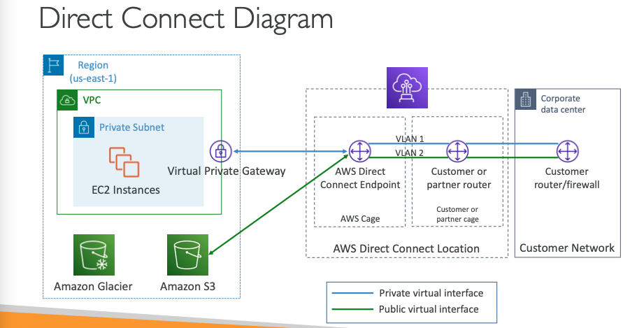

* You can use Direct Connect Gateway to connect one or more VPC in many different regions (same account)

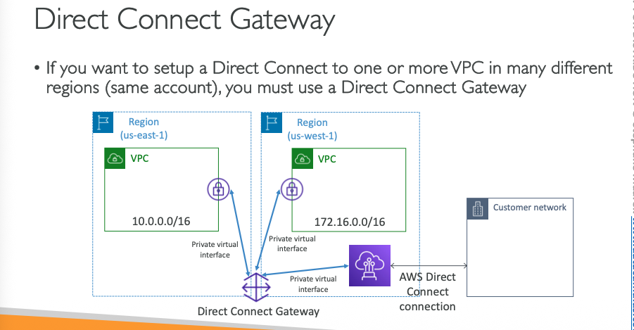

### Direct Connect - Connection Types

* Dedicated Connection
    * Physical Ethernet connection associated with a single customer
    * Speeds from 1 Gbps to 100 Gbps
* Hosted Connection:
    * Connetion requests are made via AWS Connext Partners
    * Speeds from 50 Mbps to 10 Gbps

### Encryption

* Direct Connect does not provide encryption by default
* You can use MACsec (Media Access Control Security) for encryption on 1 Gbps
* You can also use AWS Site-to-Site VPN over Direct Connect for encryption

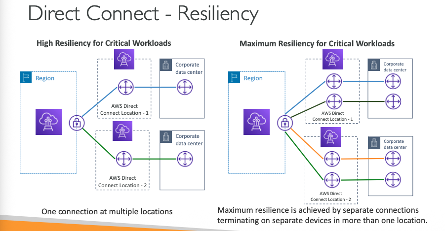

### Site-to-Site VPN connection as a backup

* You can use a Site-to-Site VPN connection as a backup for your Direct Connect connection

## Transit Gateway

* Benefits:
    * Like a Hub of connections
    * Unique service with broadcast properties
    * Increase the throughput using ECMP
* Network transit hub that can connect multiple VPCs and on-premises networks
* Simplifies network architecture by consolidating connections
* Supports inter-region peering
* Scales elastically based on network traffic
* Supports multicast traffic
* Centralized management of network connections
* Supports integration with AWS Direct Connect and VPN connections
* Pay-as-you-go pricing model based on data processed and attachments
* ECMP = Equal-cost multi-path

## VPC Traffic Mirroring

* Allows you to capture and inspect network traffic in your VPC.
* Capture the traffic:
    * From (source) - ENI
    * To (Targets) - an ENI or a Network Load Balancer

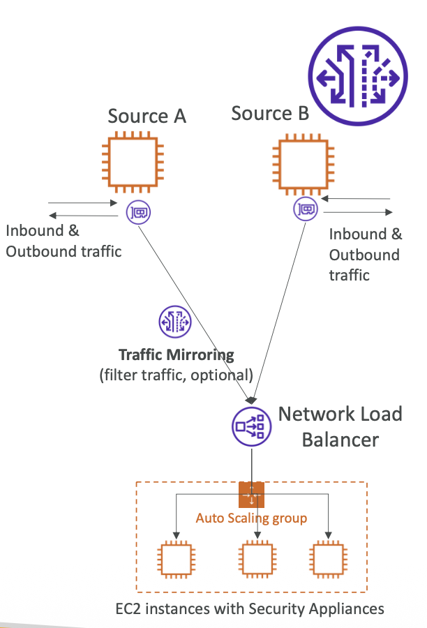

## IPV6

* Is the succesor of IPv4
* Uses 128-bit addresses, represented in hexadecimal format
* Provides a much larger address space than IPv4
* IPv6 addresses are represented as eight groups of four hexadecimal digits, separated by colons
* Example: 2001:0db8:85a3:0000:0000:8a2e:0370:7334
* IPv6 addresses can be abbreviated by omitting leading zeros and consecutive groups of zeros
* Example: 2001:0db8:85a3::8a2e

## Egress Only Internet Gateway

* Used for IPv6 only
* Similar to a NAT Gateway but for IPv6

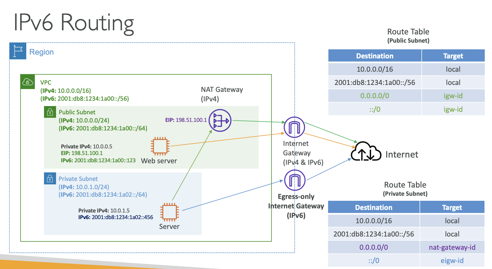

## AWS NetworkFirewall

* Protect your entire Amazon VPC from layer 3 to layer 7
* Stateful, managed, network firewall and intrusion detection and prevention service for VPCs
* Provides fine-grained control over network traffic
* Supports custom rules and managed rule groups
* Can be deployed in a highly available configuration across multiple Availability Zones
* Pay-as-you-go pricing model based on the number of firewall endpoints and data processed
* Can be used to protect VPCs from common web exploits and vulnerabilities
* Can be used to monitor and log network traffic for security analysis and compliance auditing

## VPC Pricing

* VPC itself is free, but there are costs associated with using VPC components and features
* Internet Gateway: Free
* NAT Gateway: $0.045 per hour + $0.045 per GB of data
* VPC Endpoints:
    * Interface Endpoints: $0.01 per hour + $0.01 per GB of data processed
    * Gateway Endpoints: Free
    * VPC Flow Logs: Costs for storing and analyzing logs in CloudWatch Logs or S3
    * AWS Site-to-Site VPN: $0.05 per hour + data transfer costs
    * AWS Direct Connect: Costs based on port hours and data transfer
