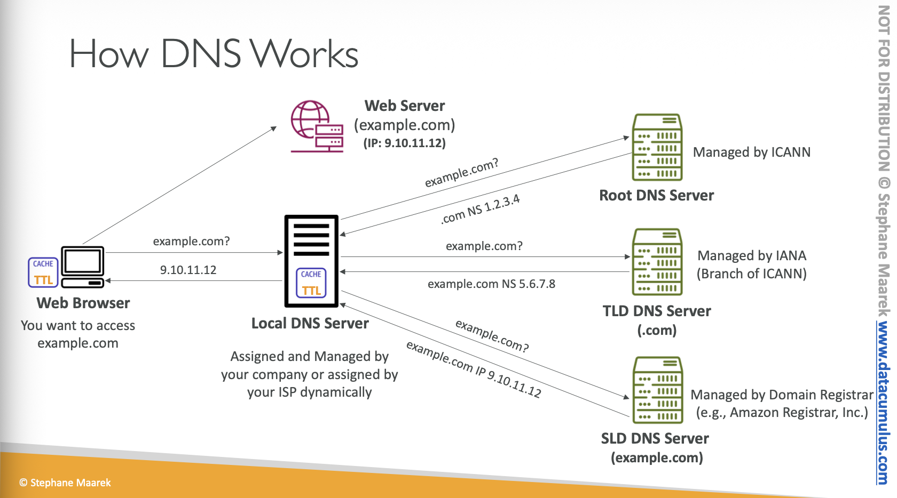
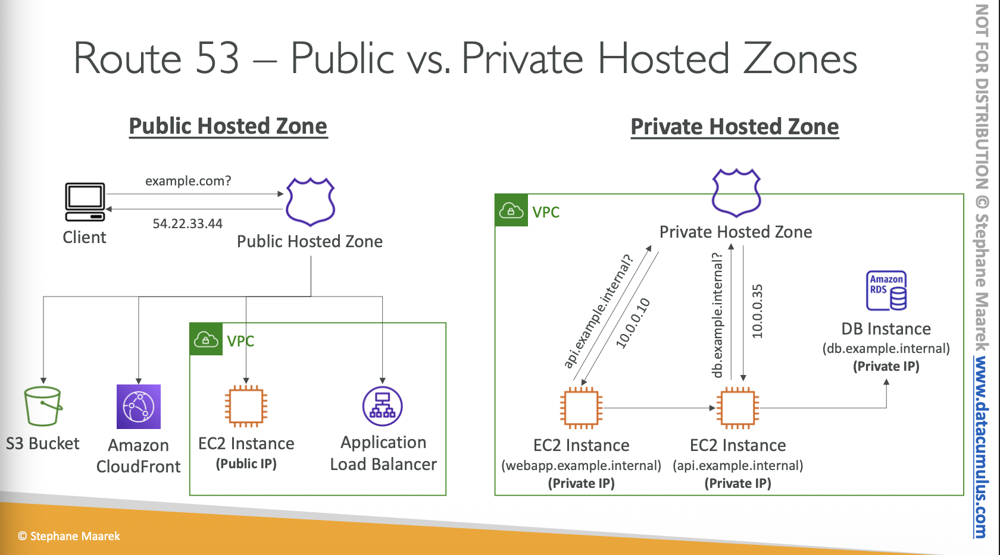

# Route 53

## What is a DNS?

* Domain Name Systme wich translate the human friendly hostnames into the machine IP addresses
  * wwww.google.com => 172.217.1836
  * DNS is the backnbone of the internet
  * DNS uses hierarchical naming structure
  * DNS is a distributed database
  * DNS uses caching to improve performance
  * DNS uses UDP port 53

* DNS Terminologies
  * Domain Register
  * DNS Records
  * Zone File: containes DNS records
  * Name Server: resolves DNS queries
  * Top Level Domain (TLD): .com, .us, .in, .gov, .org,...
  * Second Level Domain (SLD): amazon.com, google.com.
  * Fully Qualified Level Domain

## Whats is Amazon Route53?

* Amazon Route 53 is a highly available and scalable Domain Name System (DNS) web service
* Records:
  * How you want to route traffic for a domain
  * Domain/subdomain Name - example.com
  * Value - IP address, another domain name, etc.
  * TTL - how long DNS resolvers cache the information
  * Routing Policy - how Route 53 responds to DNS queries
  * Types:
    * A Record: maps a domain name to an IPv4 address
    * AAAA Record: maps a domain name to an IPv6 address
    * CNAME Record: maps a domain name to another domain name
      * The target is a domain name which must have an A or AAAA record
      * Example: you can not create for example.com, but you can create for <www.example.com>
    * MX Record: maps a domain name to mail servers
    * TXT Record: used to store text information
    * NS Record: specifies the authoritative name servers for a domain
    * SRV Record: used to define the location of servers for specific services
    * PTR Record: used for reverse DNS lookups

## Route 53 - Hosted Zones

* A hosted zone is a container for records that defines how to route traffic to a domain and its subdomain
* Public Hosted Zone - containes records that specify hot to route traffic on the internet: application1.mypublicdomain.com
* Private Hosted Zones - contains records that specify how you route traffic within on or more VPC: application1.company.internal

