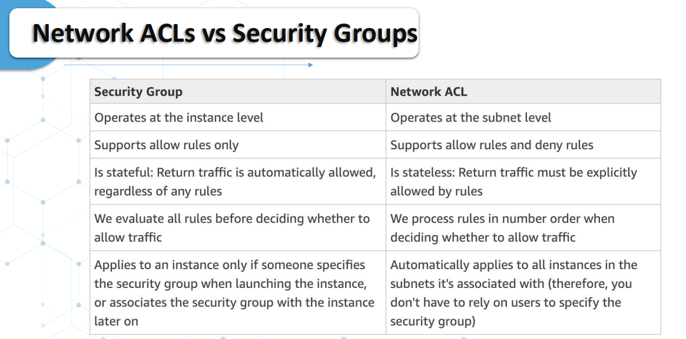
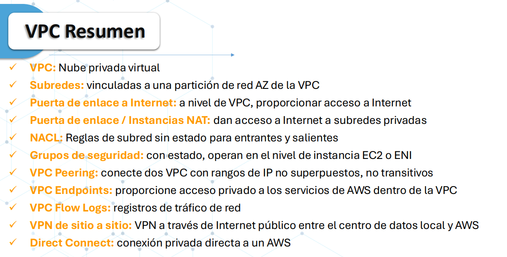

# Networking and Content Delivery

## Amazon VPC

* VPC: Virtual Private Cloud
* Subredes por zona de disponibilidad:
    * Públicas
    * Privadas
    * Hasta 200 subredes por VPC
* CIDR: Classless Interdomain Routing
* Tablas de enrutamiento:
    * Cada subred tiene una tabla de enrutamiento
    * Se pueden asociar con múltiples subredes
    * Puedes tener 50 rutas por tabla de rutas
* Enrutamiento:
    * Internet Gateway (Subredes públicas):
        * Ayudan a que la instancia de EC2 se pueda comunicar al exterior
    * NAT Gateway (Networking Address Translate):
        * Permiten que las instancias de las subredes privadas accedan a Internet sin dejar de ser privadas
    * VPN Gateway:
    * AWS Transit Gateway
    * AWS Direct Connect
    * Peering Connect
* Dirección IPv4 elástica es una dirección estática

## Security

* NACL (Network Access Control):
    * No tiene estado
    * Allow and Deny 
    * Se adjuntan en el nivel de subred
    * Las reglas sólo incluyen direcciones IP
* Security Groups:
    * Sí tiene estado
    * Sólo puede tener reglas ALLOW
    * Las reglas incluyen direcciones IP y otros grupos de seguridad

* VPC Flow Logs:
    * Captura información sobre el tráfico IP que ingresa a sus interfaces:
        * Registro de flujo de VPC
        * Registro de flujo de subred
        * Registro de flujo de la interfaz de red elástica

## Opciones de conectividad

* VPC Peering
    * CIDR no deben estar superpuestos
    * Se debe establecer cada conexión entre VPC (No transitivo)
* AWS Transit Gateway:
    * Permite conectar varias VPC centralizando la conexión
* VPC Endpoint:
    * VPC Endpoint Gateway:
        * S3 and DynamoDB
    * VPC Endpoint Interface (ENI):
        * Resto de servicio
        * Sólo se usa dentro de su VPC

## On-premises

* VPN:
    * Using Public Internet
* Direct Connect:
    * Conexión física entre instalaciones
    * Conexión privada
    * Al menos de un mes
* AWS Private Link:
    * Igual que los VPC Endpoints, sólo que se escala a miles de VPC

## Route53

## Cloudfront
