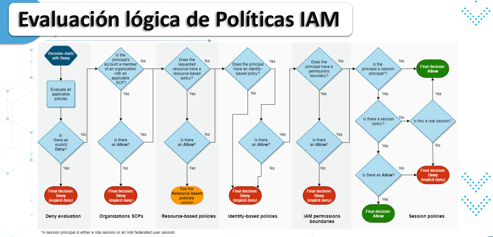
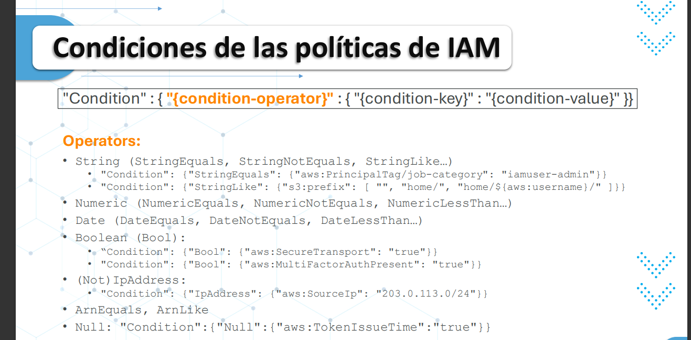

# Seguridad en la nube

## Share Responsability Model

Check: https://aws.amazon.com/es/compliance/shared-responsibility-model/

* AWS: De la nube
* Cliente: En la nube

* Access: CLI, SDK, and Console
* Máximo dos Access Keys por usuario

* AWS Service Health Dashboard
* AWS Personal Health Dashboard

## Gestión de Identidad y Acceso (IAM - Identity and Access Management)

¿Cómo sabemos que eres quien dices ser?

* AAA: 
    * Authenticate: 
        * IAM Username/Password
        * Access Key
        * MFA
        * Federation
    * Authorize:
        * IAM Policies 
    * Audit:
        * CloudTrail

### Principales de AWS

* Root 
* Users, groups, and roles
* Temporal Security Credentials

### Policy

* VIS + SEPARC

* Version
* Id
* Statement
    * SEPARC:
        * Sid
        * Effect
        * Principal
        * Action
        * Resources
        * Condition

### IAM Security Tools

* IAM Credential Report
* IAM Access Analyzer

### Multi account strategy

* Service Control Policy (SCP):
    * Restringir los privilegios de la cuenta mediante políticas de control de servicios

* AWS Organizations
* Multi account:
    * Organization Units (OUs):
        * Strategies:
            * Business Unit
            * Environmental Lifecycle
            * Project-based

### AWS Organizations - OrganizationAccountAccessRole

* Rol de IAM que concede permisos de administrador completo en la cuenta de miembro a la cuenta de administración 
* Rol para realizar tareas de administración
* Se agrega automáticamente a todas las cuentas de miembros 
* En una cuenta existente se debe crear el rol
* Es posible eliminar, enviar invitación y aceptar invitación

* Service Control Policies (SCP):
    * A nivel de unidad organizativa
    * No se aplica a la cuenta principal
    * Los roles no pueden ser restringidos por SCP
    * Allow explícito por default
    * Se utiliza para cumplimiento y restringir acceso a servicios. 
    * La jerarquía permite que se denieguen servicios desde la master o root account



### AWS Control Tower

* Configura y controla entornos multiaccount

### AWS Resource Access Manager (AWS RAM)

* Comparta los recursos de AWS que posee con otras cuentas de AWS:
    * Aurora
    * VPC subnets
    * Transit Gateway 
    * Route53
    * EC2 dedicated hosts
    * License manager

### AWS Service Catalog

* Recursos predeterminados por el equipo de TI

## Policies in deep

```json
{
    "Version":"2012-10-17",
    "Statement":[
        {
            "Effect":"Allow",
            "Action":"*",
            "Resource":"*",
            "Condition":{
                "{condition-operator}":{
                    "{condition-key}":"{condition-value}"
                }
            }
        }
    ]
}
```



* Es mejor asociar una política a un recurso (ejemplo: política de bucket de S3) en lugar de asociar una función como proxy

### IAM Permission Boundary

* Los límites son compatibles con usuarios y roles, no para grupos.
* Busca establecer los permisos máximos
* Permite la autogestión pero no pueden escalar sus privilegios

### IAM Acess Analyzer

* Ayuda a identificar las políticas y servicios utilizados por los usuarios

### Security Token Service (STS)